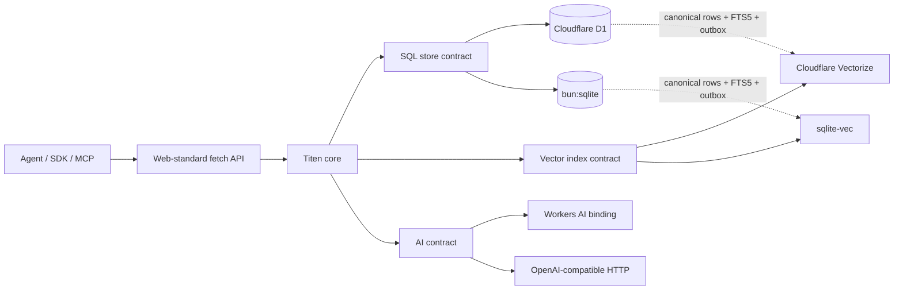
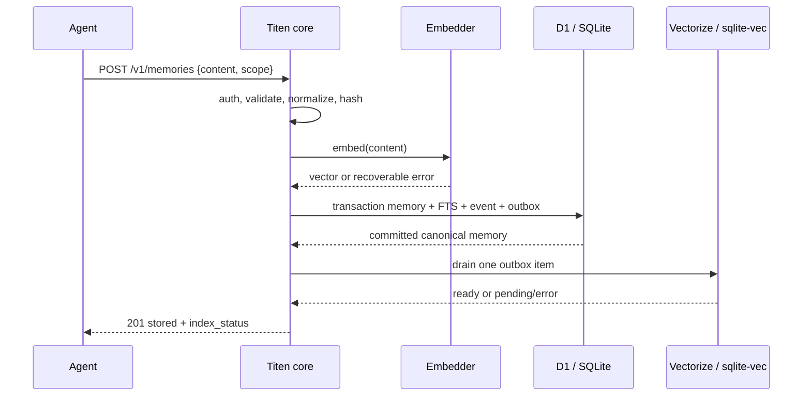

# Titen — Blueprint OSS Memory untuk AI Agent

> Catatan arah produk: Titen sekarang menargetkan **Level 6 — Collaborative
> Memory Fabric**, dibangun di atas kernel **Level 5 — Evidence-Grounded Context
> Memory**. [PRD](./docs/PRD.md) adalah kontrak produk authoritative dan
> [README](./README.md) adalah ringkasannya. Dokumen ini dipertahankan sebagai
> audit teknis dan blueprint infrastruktur; keputusan lama yang bertentangan
> dengan PRD dinyatakan superseded.

Status: rancangan memory service; dashboard Astro sintetis telah diimplementasikan
Tanggal audit: 26 Juli 2026  
Target runtime: Cloudflare Workers dan VPS dengan Bun  
Bahasa dan package manager: TypeScript, pnpm  
Lisensi yang disarankan: Apache-2.0

## 0. Keputusan produk dan struktur OSS

Keputusan 26 Juli 2026:

- positioning Titen adalah Level 6 untuk personal, company, dan enterprise;
- implementasi dimulai dari kernel Level 5 yang kecil dan dapat diuji;
- satu codebase dan satu model data melayani ketiga skala tersebut;
- kolaborasi single-deployment dibangun sebelum federation;
- Titen menyimpan coordination memory, tetapi tidak menjalankan agent loop atau
  menjadi task scheduler umum;
- D1/SQLite tetap canonical; vector index dan compiled views dapat dibangun
  ulang.
- knowledge untuk CRM/chatbot eksternal memakai snapshot release yang eksplisit,
  versioned, dan approved; `verified` bukan izin publikasi dan raw canonical
  memory tidak menjadi endpoint publik.

Dokumen authoritative:

1. `docs/PRD.md` — kebutuhan produk dan acceptance criteria;
2. `docs/architecture/` — kontrak arsitektur, memory model, dan collaboration;
3. `docs/decisions/` — keputusan yang sulit dibalik;
4. `docs/ROADMAP.md` — urutan delivery;
5. dokumen ini — bukti audit, batas platform, dan opsi yang pernah dievaluasi.

### 0.1 Audit struktur Mem0

Struktur upstream diverifikasi pada `mem0ai/mem0` `origin/main` commit
`b357a5a1b03c299ec8229c268e63cfac0f7c6566` tanggal 25 Juli 2026.

Pola yang diambil:

- root memiliki `README.md`, `CONTRIBUTING.md`, `SECURITY.md`, `AGENTS.md`, dan
  `LICENSE` sebagai entrypoint OSS;
- `AGENTS.md` memetakan direktori, runtime, command, dan aturan kontribusi untuk
  coding agents;
- `docs/` memisahkan introduction, core concepts, open-source setup, API
  reference, integrations, cookbooks, migrations, dan contributing;
- `.github/` menyediakan issue forms dan pull request template;
- implementation, tests, examples, server, integrations, dan docs dipisahkan.

Pola yang tidak diambil:

- polyglot monorepo Python/TypeScript/CLI/server/UI;
- 336 file docs dan satu halaman per provider;
- Mintlify sebelum kebutuhan navigasi dan publishing benar-benar ada;
- duplikasi hosted platform versus OSS;
- workflow CI/release besar sebelum runtime pertama tersedia.

Struktur Titen yang disetujui:

```text
titen/
├── .github/                  # issue forms dan PR template
├── docs/
│   ├── PRD.md
│   ├── ROADMAP.md
│   ├── architecture/         # overview, memory model, collaboration
│   ├── deployment/           # Cloudflare dan VPS
│   ├── reference/            # kontrak API
│   └── decisions/            # architecture decision records
├── AGENTS.md
├── CONTRIBUTING.md
├── SECURITY.md
├── README.md
├── blueprint.md
└── LICENSE
```

Direktori `src/`, `migrations/`, `test/`, dan `examples/` dibuat saat P0 mulai,
bukan sebagai folder kosong. Struktur source target dicatat di dokumen
arsitektur agar scaffolding mengikuti hasil spike, bukan mendahuluinya.

## 1. Keputusan ringkas fondasi Level 5

Bagian 1–25 mendokumentasikan rancangan kernel dan audit awal sebelum keputusan
Level 6. Gunakan bagian 0 dan PRD untuk arah produk; gunakan bagian berikut ini
untuk detail fondasi runtime yang masih relevan.

Titen layak dibangun sebagai memory service OSS yang berjalan di dua lingkungan:

- Cloudflare: Worker + D1 + Vectorize + Workers AI.
- VPS: satu proses Bun + satu file SQLite + `sqlite-vec`, dengan model AI melalui endpoint OpenAI-compatible.

Arsitektur yang disarankan bukan port Mem0 dan bukan monorepo provider besar. Titen memakai satu core TypeScript, satu kontrak HTTP berbasis Web Standards, dan dua adapter runtime tipis.

Keputusan utama:

1. D1/SQLite adalah sumber kebenaran. Vectorize/`sqlite-vec` hanya indeks turunan yang boleh dibangun ulang.
2. Titen menyimpan memori atomik, bukan seluruh percakapan dan bukan dokumen panjang.
3. Retrieval v1 memakai vector search + FTS5 + Reciprocal Rank Fusion (RRF). Tidak ada knowledge graph, reranker, MMR, persona pipeline, atau autonomous consolidation di v1.
4. Penambahan otomatis dari percakapan memakai satu ekstraksi LLM yang hanya boleh menghasilkan aksi `ADD`. Update dan delete tetap eksplisit.
5. Isolasi tenant berasal dari API key, bukan dari `tenant_id` yang dikirim klien.
6. Cloudflare memakai binding native `env.VECTORIZE`, bukan Cloudflare account REST API/token di dalam Worker.
7. VPS memakai `bun:sqlite`, `Bun.serve`, dan `sqlite-vec`. Tidak perlu Node server, ORM, Redis, Postgres, Qdrant, atau Docker untuk instalasi dasar.
8. pnpm hanya mengelola paket dan lockfile; Bun tetap menjadi runtime dan test runner VPS.

Target v0.1 yang paling kecil tetapi berguna adalah REST API dengan direct remember, recall, CRUD, history, tenant isolation, hybrid search, outbox/repair, dan export/import. Ekstraksi percakapan dan MCP menyusul di v0.2 setelah fondasi lolos contract test di kedua runtime.

## 2. Interpretasi permintaan dan batas audit

Istilah “repo Mem0 ponco” tidak cocok dengan direktori atau Git remote bernama Ponco di workspace ini. Audit mendalam karena itu memakai:

- fork lokal Rama: `/srv/titen-workspace/Project/local-mem0-fork`;
- upstream: [`mem0ai/mem0`](https://github.com/mem0ai/mem0).

Jika “Ponco” adalah repo lain, URL-nya perlu ditambahkan pada audit lanjutan. Rancangan ini tidak bergantung pada asumsi bahwa fork lokal identik dengan upstream.

Audit dilakukan read-only terhadap repo pembanding. Tidak ada source repo yang diubah. Snapshot yang diperiksa:

| Repo                                                                                  |       Snapshot | Kedalaman audit                                            | Relevansi                                              |
| ------------------------------------------------------------------------------------- | -------------: | ---------------------------------------------------------- | ------------------------------------------------------ |
| `RamaAditya49/local-mem0-fork` / `mem0ai/mem0`                                              | `69201e9591b7` | kode inti TS, Vectorize adapter, history, provider factory | baseline Mem0 dan pelajaran produksi lokal             |
| [`rahilp/second-brain-cloudflare`](https://github.com/rahilp/second-brain-cloudflare) | `b1e11f00482e` | kode Worker, schema, write dan recall flow                 | pembanding Cloudflare terdekat                         |
| [`supermemoryai/supermemory`](https://github.com/supermemoryai/supermemory)           | `6f3c835e8f9f` | repo, local distribution, MCP Worker                       | Bun/local UX dan MCP, dengan batas source availability |
| [`Tencent/TencentDB-Agent-Memory`](https://github.com/Tencent/TencentDB-Agent-Memory) | `45e6e80ae2e6` | config, SQLite/FTS/vector flow, layering                   | pembanding TypeScript + SQLite + `sqlite-vec`          |
| [`getzep/graphiti`](https://github.com/getzep/graphiti)                               | `448e57c5841f` | arsitektur, data model, provider/storage                   | temporal provenance dan graph memory                   |
| [`langchain-ai/langmem`](https://github.com/langchain-ai/langmem)                     | `56d85939d80b` | primitives dan dependency surface                          | hot-path vs background memory                          |
| [`MemoriLabs/Memori`](https://github.com/MemoriLabs/Memori)                           | `56600c525ba3` | TS SDK, BYODB, Rust core, attribution                      | entity/process/session attribution                     |

Repo lain seperti Letta, Cognee, Acontext, Mastra, dan MatrixOrigin Memoria diperiksa pada tingkat positioning/README untuk memastikan Titen tidak tanpa sengaja menjadi agent framework, graph platform, atau version-control engine.

Nama package `titen` belum ditemukan di npm saat dicek pada 26 Juli 2026 (`npm view titen` menghasilkan 404). Ini bukan pemeriksaan merek dagang, domain, atau jaminan bahwa nama masih tersedia ketika publikasi dilakukan.

## 3. Hasil audit repo

### 3.1 Mem0 / fork `local-mem0-fork`

Yang baik dan layak diambil:

- scope `user_id`, `agent_id`, dan `run_id` jelas;
- satu panggilan LLM untuk ekstraksi memori;
- algoritma terbaru bersifat additive: ekstraksi menghasilkan memori baru, bukan meminta LLM menebak update/delete;
- semantic, keyword, entity, dan optional reranking dapat dikombinasikan;
- riwayat perubahan dipisahkan dari record memori;
- provider embedder, LLM, vector store, dan history dapat diganti.

Masalah untuk target Titen:

- `mem0-ts/src/oss/src/memory/index.ts` sudah 2.172 baris dan menggabungkan terlalu banyak kebijakan;
- factory mengimpor banyak provider Node/native secara statis;
- history default memakai `better-sqlite3`;
- hashing memakai Node `crypto.createHash` dan MD5;
- entity memory membuat vector collection kedua serta pipeline tambahan;
- vector store ikut menjadi tempat payload utama, sehingga database canonical dan indeks tidak tegas dipisahkan;
- adapter Vectorize memakai Cloudflare SDK/REST account API, `accountId`, dan API token, bukan binding native Worker;
- adapter Vectorize mencoba melakukan operasi list/migration melalui query vektor nol;
- default dimensi mudah berbeda dari model aktual.

Pelajaran produksi dari fork lokal paling penting adalah insiden dimensi: schema/vector collection 1536 tidak cocok dengan BGE-M3 1024. Titen harus memiliki embedding fingerprint dan menolak status ready jika model, dimensi, atau metric tidak cocok.

Kesimpulan: ambil bentuk API, scope, history, dan ADD-only extraction. Jangan port provider matrix, entity graph, atau vector-store-as-database.

### 3.2 `second-brain-cloudflare`

Repo ini membuktikan kombinasi Worker, D1, Vectorize, Workers AI, KV, OAuth, MCP, cron, dan TypeScript dapat bekerja. Pola yang benar:

- D1 menyimpan record utama;
- Vectorize menyimpan vector ID dan metadata;
- embedding melalui Workers AI binding;
- recall dapat turun ke keyword-only ketika Vectorize gagal;
- dense dan keyword candidates digabung dengan RRF;
- write non-kritis memakai `ctx.waitUntil()`;
- health check menjelaskan Vectorize yang hilang.

Namun ini bukan fondasi yang tepat untuk di-fork langsung:

- `src/index.ts` berisi 3.644 baris;
- schema awal hanya `entries` dan `edges`, tanpa tenant boundary;
- keyword retrieval menggunakan beberapa `LIKE '%token%'`, bukan FTS5;
- duplicate detection, contradiction LLM, smart merge, graph inference, MMR, time decay, classification, Notion sync, nightly compression, OAuth, MCP, dan dashboard berada di aplikasi yang sama;
- D1 insert dan Vectorize insert tidak memakai durable outbox;
- Vectorize mutation memang asynchronous, sehingga `waitUntil()` saja belum memberi jaminan indeks sudah queryable.

Kesimpulan: ambil native bindings, D1 canonical store, degraded recall, dan RRF. Jangan ambil monolith atau fitur “second brain” yang belum dibutuhkan memory service.

### 3.3 Supermemory

Hal yang relevan:

- repo utamanya memakai TypeScript/Bun;
- local UX menargetkan satu binary dan API yang sama antara local/cloud;
- local distribution menawarkan embedded graph, local embeddings, profiles, dan hybrid search;
- MCP server adalah Cloudflare Worker dengan Durable Object, OAuth, dan Streamable HTTP.

Batas audit penting: source engine dari `supermemory local` tidak terlihat sebagai implementasi lengkap di repo publik yang diperiksa; repo menjelaskan `npx supermemory local`, tetapi source yang tampak dominan adalah web app, clients, integrations, dan MCP proxy ke API Supermemory. Karena itu repo ini adalah referensi UX/distribution, bukan bukti bahwa engine local/cloud mereka dapat langsung dipakai sebagai basis OSS Titen.

MCP mereka juga memakai Durable Object karena butuh session/OAuth. Memory tools Titen tidak membutuhkan state sesi, sehingga MCP stateless lebih kecil dan tidak memerlukan Durable Object.

### 3.4 TencentDB Agent Memory

Ini pembanding VPS TypeScript yang paling relevan:

- SQLite + `sqlite-vec` lokal;
- FTS5/BM25 + vector search + RRF;
- source attribution dan data antara dapat diperiksa manusia;
- pemisahan host adapter dan core;
- fallback vector → FTS;
- BGE-M3 dan endpoint embedding remote dapat dikonfigurasi.

Yang tidak perlu dibawa ke v1:

- pipeline L0 Conversation → L1 Atom → L2 Scenario → L3 Persona;
- OpenClaw-specific hooks, offload, canvases, reporter, dan banyak trigger;
- tokenizer native bahasa khusus;
- sekitar 39 ribu baris source TS/JS/Python pada snapshot;
- dependency AI SDK, tokenizer, JSON5, YAML, dan runtime lain yang tidak dibutuhkan service dasar.

Kesimpulan: `sqlite-vec`, FTS5, RRF, traceability, dan fallback adalah valid. Layered persona/consolidation baru ditambahkan jika eval dan use case nyata membutuhkannya.

### 3.5 Graphiti

Graphiti kuat untuk:

- episode sebagai provenance;
- entity/fact dengan validity windows;
- bi-temporal state;
- hybrid semantic + BM25 + graph traversal;
- invalidation ketika fakta berubah.

Biayanya adalah Python, LLM-intensive ingestion, serta Neo4j/FalkorDB/Neptune dan full-text backend. Ini terlalu berat untuk Worker dan VPS kecil.

Kesimpulan: simpan `source_ref`, event history, `created_at`, dan `expires_at` sejak awal agar temporal graph bisa ditambah nanti. Jangan bangun graph di v1.

### 3.6 LangMem

LangMem memisahkan dua cara menulis memori:

- hot path: agent secara eksplisit memanggil manage/search tools;
- background: manager mengekstrak dan mengonsolidasikan interaksi.

Pemisahan konsep ini bagus. Implementasinya Python dan terkait LangChain/LangGraph, sehingga bukan runtime Titen.

Kesimpulan: direct remember harus menjadi primitive utama dan tetap berfungsi tanpa LLM. Background inference bersifat tambahan, bukan syarat penyimpanan.

### 3.7 Memori

Memori menekankan attribution berdasarkan entity, process, dan session serta menangkap apa yang agent lakukan, termasuk hasil tool. TypeScript SDK menyediakan BYODB, tetapi menggunakan native/Rust core dan driver Node seperti `better-sqlite3`; jalur ini tidak cocok langsung untuk Worker.

Kesimpulan: pertahankan `subject_id`, `agent_id`, `run_id`, dan source provenance. Tool outcome adalah sumber memori episodik yang baik, tetapi automatic interception tetap pekerjaan integration layer, bukan core v1.

### 3.8 Ringkasan “ambil / tunda”

| Konsep                                     | Keputusan Titen                                         |
| ------------------------------------------ | ------------------------------------------------------- |
| Scoped memory (`subject`, `agent`, `run`)  | ambil di v0.1                                           |
| D1/SQLite canonical + vector index turunan | ambil di v0.1                                           |
| FTS5 + vector + RRF                        | ambil di v0.1                                           |
| Provenance dan history                     | ambil di v0.1                                           |
| Direct/hot-path remember                   | ambil di v0.1                                           |
| ADD-only conversation extraction           | v0.2                                                    |
| Stateless MCP tools                        | v0.2                                                    |
| Automatic contradiction/update/delete      | tunda; manual dahulu                                    |
| Entity graph / temporal graph              | tunda sampai ada bukti kualitas                         |
| Persona L0→L3 / consolidation              | tunda sampai ada bukti kebutuhan                        |
| Reranker, MMR, time-decay                  | tunda sampai eval menunjukkan RRF kurang                |
| OAuth browser flow / Durable Object        | tunda sampai ada kebutuhan multi-user interactive login |
| Memory Atlas dashboard                     | v0.2 read-only integration; v0.3 governance lenses      |
| Connectors dan general-purpose UI          | bukan core; integration terpisah                        |

## 4. Tujuan fondasi Level 5

Titen adalah memory service, bukan agent framework.

Tujuan v1:

- OSS dan bisa di-self-host tanpa layanan Titen Cloud;
- satu API yang konsisten di Worker dan VPS;
- memori tenant/user/agent/run terisolasi;
- direct remember tanpa LLM;
- optional conversation-to-memory extraction;
- semantic + lexical recall dengan degraded mode;
- update/delete/history yang auditable;
- data dapat diekspor dari Cloudflare lalu diimpor ke VPS, dan sebaliknya;
- dependency dan resource footprint kecil;
- aman gagal tanpa kehilangan canonical data.

Non-goal v1:

- menjadi drop-in replacement penuh untuk semua endpoint Mem0;
- menyimpan file/document corpus besar;
- menjalankan agent, prompt loop, atau chat UI;
- knowledge graph;
- autonomous persona;
- automatic contradiction resolution;
- provider matrix puluhan database/model;
- multi-region strongly consistent vector search;
- hosted control plane Titen.

## 5. Arsitektur target



Core hanya mengenal tiga capability yang memang memiliki dua implementasi:

```ts
type SqlStore = {
  create(input: NewMemory): Promise<Memory>;
  searchText(input: TextSearch): Promise<RankedId[]>;
  hydrate(input: HydrateRequest): Promise<Memory[]>;
  // CRUD, events, outbox, export/import
};

type VectorIndex = {
  upsert(memory: IndexedMemory): Promise<VectorMutation>;
  search(query: VectorQuery): Promise<RankedId[]>;
  delete(id: string, tenantNamespace: string): Promise<VectorMutation>;
};

type ModelGateway = {
  embed(texts: string[]): Promise<Float32Array[]>;
  extract?(messages: Message[]): Promise<ExtractedMemory[]>;
};
```

Tidak perlu factory generik. Runtime entrypoint membuat object capability yang konkret lalu memberikannya ke core.

## 6. Runtime matrix

| Capability        | Cloudflare                             | VPS                                           |
| ----------------- | -------------------------------------- | --------------------------------------------- |
| HTTP              | Worker `fetch`                         | `Bun.serve({ fetch })`                        |
| canonical SQL     | D1 binding                             | `bun:sqlite`                                  |
| lexical search    | D1 FTS5                                | SQLite FTS5                                   |
| vector index      | native Vectorize binding               | `sqlite-vec`                                  |
| embeddings        | Workers AI binding                     | OpenAI-compatible HTTP; default Ollama BGE-M3 |
| extraction LLM    | Workers AI binding                     | OpenAI-compatible HTTP                        |
| crypto            | Web Crypto                             | Web Crypto                                    |
| UUID              | `crypto.randomUUID()`                  | `crypto.randomUUID()`                         |
| background repair | scheduled Worker + opportunistic drain | startup drain + timer/systemd job             |
| package manager   | pnpm                                   | pnpm                                          |
| runtime           | Workers                                | Bun                                           |

Tidak memakai `nodejs_compat` pada Worker. Jika sebuah dependency memaksa flag itu, dependency tersebut harus diganti sebelum v1.

## 7. Model data

### 7.1 Prinsip

- `memories` adalah canonical state.
- embedding disimpan sebagai Float32 BLOB di SQL agar indeks dapat dibangun ulang tanpa memanggil model lagi.
- Vectorize hanya menyimpan UUID, scope key yang sudah di-hash, kind, version, dan vector.
- content tidak disalin ke Vectorize metadata.
- delete bersifat soft-delete di API; stale vector tidak pernah boleh menghidupkan kembali content yang sudah dihapus.
- history append-only.
- outbox berada dalam transaksi yang sama dengan canonical mutation.

### 7.2 Tabel minimal

```sql
CREATE TABLE tenants (
  id TEXT PRIMARY KEY,
  name TEXT NOT NULL,
  created_at INTEGER NOT NULL
);

CREATE TABLE api_keys (
  id TEXT PRIMARY KEY,
  tenant_id TEXT NOT NULL,
  subject_id TEXT,
  role TEXT NOT NULL CHECK (role IN ('reader', 'writer', 'admin')),
  secret_hash BLOB NOT NULL,
  label TEXT NOT NULL,
  created_at INTEGER NOT NULL,
  revoked_at INTEGER,
  FOREIGN KEY (tenant_id) REFERENCES tenants(id)
);

CREATE TABLE memories (
  id TEXT PRIMARY KEY,
  tenant_id TEXT NOT NULL,
  subject_id TEXT NOT NULL,
  agent_id TEXT,
  run_id TEXT,
  scope_hash TEXT NOT NULL,
  kind TEXT NOT NULL CHECK (kind IN ('semantic', 'episodic', 'procedural')),
  content TEXT NOT NULL,
  content_hash TEXT NOT NULL,
  source_type TEXT,
  source_ref TEXT,
  metadata_json TEXT NOT NULL DEFAULT '{}',
  embedding BLOB,
  embedding_fingerprint TEXT,
  embedding_dims INTEGER,
  version INTEGER NOT NULL DEFAULT 1,
  vector_state TEXT NOT NULL DEFAULT 'pending'
    CHECK (vector_state IN ('pending', 'ready', 'error')),
  created_at INTEGER NOT NULL,
  updated_at INTEGER NOT NULL,
  expires_at INTEGER,
  deleted_at INTEGER,
  FOREIGN KEY (tenant_id) REFERENCES tenants(id)
);

CREATE INDEX memories_scope_created
  ON memories(tenant_id, subject_id, agent_id, run_id, created_at DESC);
CREATE INDEX memories_vector_state
  ON memories(vector_state, updated_at);
CREATE UNIQUE INDEX memories_dedupe
  ON memories(tenant_id, scope_hash, kind, content_hash);

CREATE VIRTUAL TABLE memory_fts USING fts5(
  content,
  tokenize = 'unicode61'
);

CREATE TABLE memory_events (
  id TEXT PRIMARY KEY,
  memory_id TEXT NOT NULL,
  tenant_id TEXT NOT NULL,
  version INTEGER NOT NULL,
  event_type TEXT NOT NULL CHECK (event_type IN ('add', 'update', 'delete', 'restore')),
  snapshot_json TEXT NOT NULL,
  actor_key_id TEXT,
  created_at INTEGER NOT NULL,
  FOREIGN KEY (memory_id) REFERENCES memories(id)
);

CREATE TABLE vector_outbox (
  memory_id TEXT PRIMARY KEY,
  operation TEXT NOT NULL CHECK (operation IN ('embed_upsert', 'delete')),
  target_version INTEGER NOT NULL,
  attempts INTEGER NOT NULL DEFAULT 0,
  next_attempt_at INTEGER NOT NULL,
  mutation_id TEXT,
  last_error TEXT,
  updated_at INTEGER NOT NULL,
  FOREIGN KEY (memory_id) REFERENCES memories(id)
);

CREATE TABLE titen_meta (
  key TEXT PRIMARY KEY,
  value TEXT NOT NULL
);
```

Catatan implementasi:

- `memory_fts.rowid` harus sama dengan `memories.rowid`; insert/update/delete FTS masuk dalam batch/transaksi canonical yang sama.
- re-add untuk content yang pernah dihapus merestore record yang sama dan menaikkan version, bukan membuat duplicate baru.
- `content_hash` memakai SHA-256 atas Unicode NFC + whitespace-normalized content. Content asli tetap disimpan setelah trim, tidak di-lowercase.
- semantic/procedural memory dedupe berdasarkan content dalam scope. Episodic memory memasukkan `source_ref` ke hash agar dua kejadian dengan kalimat sama tetap bisa berbeda.
- `metadata_json` dibatasi 8 KiB dan harus berupa object JSON.

### 7.3 Embedding fingerprint

Fingerprint harus membedakan provider/model/variant/dimensi/normalisasi, contoh:

```text
workers-ai:@cf/baai/bge-m3:1024:cosine:v1
ollama:bge-m3@sha256-...:1024:cosine:v1
```

Startup/readiness melakukan tiga pemeriksaan:

1. embed satu sentinel dan pastikan output 1024 Float32 finite values;
2. bandingkan fingerprint dengan `titen_meta`;
3. pada Cloudflare, bandingkan dengan `env.VECTORIZE.describe()`.

Mismatch membuat `/readyz` gagal dan write semantic ditolak. Tidak boleh “memperbaiki” mismatch dengan padding/truncation vector.

## 8. Scope dan multi-tenancy

Addendum 27 Juli 2026: kontrak produk authoritative memisahkan tiga axis:
`trust` untuk otoritas bukti, `visibility` untuk akses internal
`private`/`team`/`organization`, dan `knowledge_release` untuk snapshot yang
boleh disajikan ke channel/audience eksternal. Detailnya ada di
[ADR-0002](./docs/decisions/0002-channel-release-not-public-memory.md). Istilah
tenant pada blueprint awal dipetakan ke organization boundary pada model produk
terbaru.

- `tenant_id` selalu berasal dari API key.
- request tidak menerima `tenant_id` sebagai authority.
- subject-scoped key hanya dapat mengakses satu `subject_id`.
- tenant-wide writer/admin key boleh memilih `subject_id` dalam tenant yang sama.
- semua SQL query wajib memuat `tenant_id`; get/update/delete by ID tetap menambahkan tenant condition.
- contract test harus mencoba ID valid milik tenant lain, bukan hanya ID acak.

Untuk Vectorize:

- namespace = opaque tenant UUID;
- metadata indexed = `subject_key`, `agent_key`, `run_key`, `kind`, `version`;
- `subject_key`/`agent_key`/`run_key` adalah Base64URL SHA-256 dari identifier asli, sehingga metadata tidak membocorkan identifier dan tetap di bawah batas 64 byte;
- canonical content dan metadata pengguna tidak masuk Vectorize.

Cloudflare saat ini membatasi namespace per index menjadi 1.000 pada Free dan 50.000 pada Paid. Itu cukup untuk self-host/small SaaS. Ketika jumlah tenant mendekati 80% batas, shard Vectorize index dan D1 berdasarkan hash tenant; jangan menambah routing layer sebelum metrik tersebut tercapai.

## 9. Write flow

### 9.1 Direct remember — v0.1



Jika embedder gagal, Titen tetap menyimpan canonical content + FTS + outbox dan mengembalikan `semantic_ready: false`. Ini mencegah kehilangan memori. Repair kemudian membuat embedding dan upsert.

Jika SQL transaction gagal, tidak ada memori dan tidak ada outbox. API mengembalikan error.

### 9.2 Conversation extraction — v0.2

Input messages diproses dengan satu prompt dan satu structured response:

```json
{
  "memories": [
    {
      "content": "Rama prefers concise deployment reports.",
      "kind": "semantic"
    }
  ]
}
```

Aturan:

- maksimal 10 memori atomik per request;
- hanya `ADD`; extractor tidak boleh mengeluarkan update/delete;
- hasil divalidasi ulang dengan Zod dan batas panjang;
- output kosong adalah sukses tanpa write;
- output invalid atau LLM error tidak boleh diam-diam menyimpan seluruh percakapan;
- raw conversation tidak disimpan default, hanya `source_ref` jika disediakan;
- update/delete tetap endpoint eksplisit.

Pola ini mengikuti arah algoritma Mem0 terbaru, tetapi menghindari decision matrix `ADD/UPDATE/DELETE/NONE` yang mahal dan sulit diaudit.

## 10. Recall flow

1. Authenticate dan tentukan tenant/subject scope.
2. Validate query, filters, dan `limit` (default 5, maksimum 20).
3. Embed query. Jika gagal, lanjut FTS-only dengan `degraded.semantic = true`.
4. Jalankan paralel:
   - vector search sebanyak `min(limit * 3, 50)`;
   - FTS5 sebanyak `limit * 3`;
   - Cloudflare recent/pending overlay.
5. Gabungkan ranking vector dan FTS dengan RRF, `k = 60`.
6. Hydrate canonical rows dari SQL dengan tenant/scope dan `deleted_at IS NULL`.
7. Tolak vector hit jika metadata version tidak sama dengan canonical version.
8. Return top K beserta provenance dan komponen score.

Tidak ada LLM pada recall v1. Tidak ada reranker.

### 10.1 Read-your-writes pada Vectorize

Vectorize insert/upsert/delete asynchronous. Changelog Cloudflare per 1 Juli 2026 menyebut median perubahan menjadi queryable di bawah 30 detik dan p99 di bawah 2 menit. Karena itu sukses menerima mutation bukan read-your-writes.

Titen menangani ini tanpa Durable Object:

- embedding disimpan di D1;
- recall Cloudflare mengambil maksimum 64 memori `pending` atau yang baru di-update dalam grace window 5 menit;
- cosine query dihitung untuk bounded overlay tersebut;
- overlay digabung dengan hasil Vectorize dan FTS;
- scheduled repair serta opportunistic drain mengonfirmasi vector lalu mengubah `vector_state` menjadi `ready`;
- stale delete/update dari Vectorize tidak lolos canonical hydration/version check.

Ceiling ini disengaja: bila satu tenant menulis lebih dari 64 memori dalam grace window secara rutin atau Worker Free melewati budget CPU 10 ms, pindahkan drain ke Queue atau per-tenant Durable Object. Jangan menambah keduanya sebelum metrik menunjukkan kebutuhan.

### 10.2 FTS query safety

Query pengguna tidak boleh disisipkan mentah ke FTS `MATCH`. Parser kecil harus:

- membatasi panjang;
- memecah token Unicode;
- escape quote dan operator FTS;
- menghapus token kosong;
- menggunakan prepared statements;
- jatuh ke pencarian phrase sederhana ketika semua token invalid.

FTS5 `rank`/BM25 mengurutkan score yang lebih baik secara numerik lebih kecil. Adapter mengubahnya menjadi rank position sebelum RRF agar runtime tidak bergantung pada skala score.

## 11. API v1

Semua JSON eksternal memakai `snake_case` agar dekat dengan ekosistem Mem0 dan mudah dipetakan.

### 11.1 Endpoint v0.1

| Method   | Path                       | Fungsi                         |
| -------- | -------------------------- | ------------------------------ |
| `POST`   | `/v1/memories`             | direct remember                |
| `POST`   | `/v1/memories/search`      | hybrid recall                  |
| `GET`    | `/v1/memories`             | list dengan cursor             |
| `GET`    | `/v1/memories/:id`         | canonical get                  |
| `PATCH`  | `/v1/memories/:id`         | explicit update, version++     |
| `DELETE` | `/v1/memories/:id`         | soft delete                    |
| `GET`    | `/v1/memories/:id/history` | audit history                  |
| `POST`   | `/v1/memories/:id/restore` | restore soft-deleted record    |
| `GET`    | `/v1/export`               | admin JSONL stream             |
| `POST`   | `/v1/import`               | admin JSONL import + reindex   |
| `GET`    | `/healthz`                 | liveness tanpa data sensitif   |
| `GET`    | `/readyz`                  | dependency/dimension readiness |

`POST /v1/memories` v0.2 menerima tepat salah satu dari `content` atau `messages`. Messages mengaktifkan ADD-only extraction; tidak perlu flag inference tambahan.

### 11.2 Direct remember request

```json
{
  "subject_id": "user_123",
  "agent_id": "support-agent",
  "run_id": "ticket_456",
  "kind": "semantic",
  "content": "User prefers replies in Indonesian.",
  "source": {
    "type": "conversation",
    "ref": "ticket_456#turn_8"
  },
  "metadata": {
    "channel": "telegram"
  }
}
```

Response:

```json
{
  "data": {
    "id": "019...",
    "version": 1,
    "status": "stored",
    "semantic_ready": false
  },
  "meta": {
    "request_id": "019...",
    "degraded": false
  }
}
```

### 11.3 Recall request

```json
{
  "subject_id": "user_123",
  "query": "Bahasa apa yang disukai pengguna?",
  "agent_id": "support-agent",
  "limit": 5,
  "filters": {
    "kind": ["semantic", "procedural"],
    "created_after": 1780000000000
  }
}
```

Response item memuat `id`, `content`, `kind`, source, timestamps, version, dan score components (`vector_rank`, `text_rank`, `rrf_score`). Jangan mengembalikan raw embedding.

### 11.4 Batas input awal

- direct content: 8 KiB UTF-8;
- seluruh messages request: 64 KiB UTF-8;
- satu metadata object: 8 KiB serialized JSON;
- ID eksternal: 256 bytes;
- list/search limit: maksimum 20;
- batch import: streaming JSONL, maksimum 100 record per database batch;
- content type harus `application/json` atau `application/x-ndjson` sesuai endpoint.

Error envelope stabil:

```json
{
  "error": {
    "code": "EMBEDDING_DIMENSION_MISMATCH",
    "message": "Configured embedder returned 768 dimensions; expected 1024."
  },
  "meta": {
    "request_id": "019..."
  }
}
```

## 12. Authentication dan keamanan

### 12.1 API key

- format key: prefix publik/key ID + secret random 32 byte;
- secret hanya ditampilkan sekali;
- database menyimpan SHA-256 secret, bukan secret mentah;
- key high-entropy membuat fast hash cukup; jangan memakai password manusia sebagai API key;
- key dapat `reader`, `writer`, atau `admin`;
- key dapat tenant-wide atau dikunci ke satu subject;
- revoked key langsung menghasilkan 401.

### 12.2 Trust boundaries

- semua input HTTP dan LLM output divalidasi dengan Zod;
- SQL selalu prepared;
- tenant scope ditambahkan di adapter, bukan dipercayakan ke caller core;
- CORS off default;
- server VPS bind ke `127.0.0.1` default;
- public VPS harus berada di belakang TLS reverse proxy, Cloudflare Tunnel, atau private network;
- untuk CRM/chatbot, traffic publik berhenti di application gateway; gateway
  memakai service credential sempit dan Titen tetap authenticated;
- `verified` tidak otomatis publishable; channel release memerlukan exact claim
  version, approval terpisah, audience, validity, audit, dan revoke;
- anonymous caller tidak boleh memilih customer subject dan private customer
  memory tidak masuk release index;
- log tidak memuat content, raw prompt, API key, atau full subject ID;
- telemetry off default;
- health endpoint tidak memuat nama database, model token, atau stack trace.

### 12.3 Memory poisoning dan secrets

Memori adalah data tidak tepercaya. Titen tidak boleh menyambungkan content langsung ke system prompt atau mengeksekusi instruksi dari memory. REST/MCP mengembalikan structured data + provenance; consumer harus membatasi dan menandai memory context sebagai data.

Procedural memory hanya boleh ditulis oleh key `writer/admin` dan tidak otomatis diekstrak dari pesan user biasa pada v0.2.

Titen tidak menjanjikan pendeteksian semua secret. Dokumentasi dan MCP tool harus melarang penyimpanan credential. Secret scanning/redaction dapat ditambah kemudian, tetapi tidak menggantikan kebijakan caller.

### 12.4 Delete dan recovery

- API `DELETE` melakukan soft delete;
- hard purge hanya admin CLI dengan target tenant/memory eksplisit;
- export/backup dilakukan sebelum tenant purge;
- vector delete yang terlambat aman karena canonical hydration memfilter tombstone;
- raw backup harus mode 0600 dan tidak pernah masuk Git.

## 13. Cloudflare deployment

### 13.1 Binding v0.1

```jsonc
{
  "main": "src/cloudflare.ts",
  "compatibility_date": "<pinned-at-implementation>",
  "d1_databases": [{ "binding": "DB", "database_name": "titen" }],
  "vectorize": [{ "binding": "VECTORIZE", "index_name": "titen-memory" }],
  "ai": { "binding": "AI" },
  "triggers": { "crons": ["*/5 * * * *"] },
}
```

Tidak ada KV, R2, Queue, Durable Object, Service Binding, atau `nodejs_compat` pada v0.1.

### 13.2 Provisioning order

1. Buat D1.
2. Apply migrations.
3. Buat Vectorize index `1024`, cosine.
4. Buat metadata indexes sebelum vector pertama di-upsert: `subject_key`, `agent_key`, `run_key`, `kind`, `version`.
5. Deploy Worker.
6. Buat tenant dan API key pertama melalui CLI; print secret sekali.
7. Jalankan live smoke: unauthenticated 401, remember, immediate recall, get, delete, recall kosong, repair health.

Metadata index yang dibuat setelah vectors terlanjur ada tidak berlaku retroaktif; vectors harus di-upsert ulang. Provisioning script harus menjaga urutan ini.

### 13.3 Batas platform yang memengaruhi desain

- Vectorize: maksimum 1.536 dimensi, ID 64 byte, namespace 64 byte, 10 metadata indexes, 10 juta vectors/index.
- Vectorize query: `topK` maksimum 100 tanpa values/full metadata dan 50 jika meminta values/full metadata.
- Vectorize mutations asynchronous.
- D1: 10 GB/database pada Paid, 500 MB pada Free, row/BLOB maksimum 2 MB, 100 bound parameters, database individual single-threaded.
- Worker Free: 10 ms CPU/invocation; Paid default 30 detik dan dapat dinaikkan sampai 5 menit.
- `waitUntil()` hanya memperpanjang pekerjaan sekitar 30 detik setelah response; itu bukan job queue durable.

Konsekuensinya:

- topK internal dibatasi 50;
- batch hydration maksimal 100 ID;
- overlay vector dibatasi 64;
- outbox tetap berada di D1;
- data besar tidak disimpan sebagai satu memory;
- per-tenant D1/sharding baru dibuat ketika ukuran atau throughput aktual menuntutnya.

### 13.4 Model Cloudflare

Default embedding yang disarankan adalah `@cf/baai/bge-m3`:

- multilingual 100+ bahasa;
- 1024 dimensi;
- cosine;
- cocok dengan opsi local Ollama `bge-m3`.

P0 spike wajib memastikan schema request/response Workers AI aktual, panjang output 1024, dan kualitas query Indonesia/Jawa. Jangan mengandalkan type declaration saja.

Extractor model tidak dikunci di blueprint. Pilih setelah mini-eval structured JSON pada model Workers AI kecil. Direct remember harus tetap bekerja tanpa extractor.

## 14. VPS deployment

### 14.1 Proses

- satu proses Bun menjalankan API;
- satu SQLite file, default `/var/lib/titen/titen.db`;
- `PRAGMA journal_mode=WAL`, `foreign_keys=ON`, dan bounded `busy_timeout`;
- `sqlite-vec` di-load ke `bun:sqlite` dan dipin ke versi exact karena masih pre-v1;
- HTTP memakai `Bun.serve` dengan shared `fetch` handler;
- tidak ada ORM;
- tidak ada transpile step untuk production Bun;
- pnpm lockfile tetap authoritative.

Instalasi dasar tidak membutuhkan Docker. Distribusi pertama adalah tarball/npm package + systemd unit. OCI image baru ditambah bila pengguna benar-benar membutuhkannya.

### 14.2 AI endpoint

VPS memakai `fetch` langsung ke endpoint OpenAI-compatible:

- `/v1/embeddings` untuk embedding;
- `/v1/chat/completions` untuk optional extraction.

Tidak perlu OpenAI SDK. Endpoint dapat menunjuk ke Ollama, vLLM, llama.cpp server, 9Router, atau provider hosted yang kompatibel.

Default lokal yang disarankan:

```text
TITEN_EMBED_BASE_URL=http://127.0.0.1:11434/v1
TITEN_EMBED_MODEL=bge-m3
TITEN_EMBED_DIMS=1024
```

Ollama menyediakan `bge-m3` sekitar 1,2 GB pada library saat audit. Karena itu klaim “super ringan” berlaku untuk service Titen, bukan keseluruhan stack bila model juga self-hosted. Dua profil deployment harus didokumentasikan jujur:

- light service: Bun + SQLite + remote embedding/LLM;
- fully local: Bun + SQLite + Ollama, dengan RAM/disk model terpisah.

### 14.3 Hardening systemd

Unit produksi minimal:

- user non-root khusus `titen`;
- `WorkingDirectory=/opt/titen`;
- `StateDirectory=titen`;
- `UMask=0077`;
- `NoNewPrivileges=true`;
- `PrivateTmp=true`;
- `ProtectSystem=strict`;
- write hanya ke `/var/lib/titen`;
- restart on failure dengan backoff;
- graceful shutdown menutup HTTP dan SQLite.

Default bind localhost. TLS/public routing berada di Caddy/Nginx/Cloudflare Tunnel, bukan ditulis ulang di Titen.

### 14.4 Backup

CLI `titen backup <target>` menggunakan SQLite-safe backup/`VACUUM INTO`, membuat file timestamped mode 0600 dan checksum. Restore diverifikasi pada file baru sebelum service diarahkan ke sana. Copy file SQLite yang sedang aktif tanpa mekanisme SQLite-safe tidak didokumentasikan sebagai backup resmi.

## 15. MCP v0.2

Tambahkan tepat tiga tools:

- `titen_remember`;
- `titen_recall`;
- `titen_forget`.

Cloudflare dan official MCP TypeScript SDK mendukung stateless Streamable HTTP melalui Web Standard transport tanpa Durable Object. Titen tidak memiliki state sesi MCP, sehingga gunakan raw `WebStandardStreamableHTTPServerTransport` dan bearer API key yang sama dengan REST. `createMcpHandler()` dari Agents SDK tetap menjadi alternatif, bukan dependency default.

VPS menyediakan:

- `/mcp` Streamable HTTP dengan Web Standard transport;
- optional stdio entrypoint untuk client lokal.

Tambahan dependency hanya official MCP TypeScript SDK. OAuth dan session persistence ditunda. Tambahkan OAuth/Cloudflare Access hanya ketika client target tidak dapat mengirim bearer header atau deployment hosted membutuhkan login interaktif.

## 16. Struktur implementasi fondasi

Tree di bagian ini adalah rencana source saat P0 dimulai. Struktur dokumentasi
OSS authoritative berada di bagian 0 dan `docs/README.md`.

Titen dimulai sebagai satu package, bukan pnpm workspace:

```text
titen/
├── blueprint.md
├── README.md
├── LICENSE
├── package.json
├── pnpm-lock.yaml
├── tsconfig.json
├── wrangler.jsonc
├── migrations/
│   └── 0001_init.sql
├── src/
│   ├── app.ts           # router, auth, validation, envelopes
│   ├── memory.ts        # write/search/CRUD/RRF use cases
│   ├── types.ts         # domain types + three capability contracts
│   ├── cloudflare.ts    # D1, Vectorize, Workers AI, Worker handlers
│   ├── bun.ts           # bun:sqlite, sqlite-vec, OpenAI HTTP, Bun.serve
│   ├── migrate.ts       # shared SQL migration runner/CLI
│   └── mcp.ts           # baru pada v0.2
└── test/
    └── contract.test.ts
```

Pecah file hanya ketika ukuran/ownership nyata membutuhkannya. Jangan membuat `packages/core`, provider factories, repositories per entity, DI container, atau plugin registry di awal.

### 16.1 Dependency budget

Runtime v0.1:

- `zod` — validation pada trust boundary;
- `sqlite-vec` — hanya dipakai entrypoint VPS.

Dev:

- `typescript`;
- `wrangler`.

Runtime v0.2 menambah official MCP SDK.

Saat audit, branch utama MCP TypeScript SDK sedang menuju v2 pre-alpha dan dokumentasinya masih merekomendasikan v1.x untuk production. P2 harus memilih release stabil saat implementasi dan mem-pinnya; jangan mengikuti `main`.

Yang sengaja tidak dipakai:

- Hono/Express/Fastify;
- Drizzle/Prisma;
- OpenAI SDK;
- LangChain/LangGraph;
- Redis/Qdrant/Postgres/Neo4j;
- telemetry SDK;
- general provider factory.

Native `Request`, `Response`, `URLPattern`, Web Crypto, `Bun.serve`, prepared SQL, D1, dan SQLite sudah menutup kebutuhan tersebut.

## 17. Export, import, dan kompatibilitas

Format portable adalah versioned JSONL tanpa vector default:

```json
{
  "format": "titen-memory",
  "format_version": 1,
  "id": "...",
  "subject_id": "...",
  "kind": "semantic",
  "content": "...",
  "source": {},
  "metadata": {},
  "created_at": 1780000000000
}
```

Aturan:

- export tidak menyertakan API keys;
- embedding tidak diekspor default;
- import selalu re-embed dengan fingerprint target;
- ID dipertahankan jika tidak konflik;
- import idempotent;
- setiap record divalidasi dan error dilaporkan per line;
- import besar berjalan batch dan resumable via last line/cursor.

Adapter import Mem0 dapat dibuat setelah v0.1:

- `user_id` → `subject_id`;
- `agent_id` dan `run_id` dipertahankan;
- memory/history mapping didokumentasikan;
- vector lama dibuang dan di-embed ulang;
- tidak menjanjikan byte-for-byte Mem0 API compatibility.

## 18. Failure model

| Kegagalan                          | Perilaku yang benar                                                                  |
| ---------------------------------- | ------------------------------------------------------------------------------------ |
| embedder gagal saat add            | simpan canonical + FTS, outbox retry, `semantic_ready=false`                         |
| SQL transaction gagal              | tidak ada partial memory/history/outbox                                              |
| Vectorize/sqlite-vec upsert gagal  | canonical tetap ada, search FTS, retry outbox                                        |
| Vectorize masih eventual           | recent/pending overlay memberi read-your-writes terbatas                             |
| vector search gagal                | FTS-only + `degraded.semantic=true`                                                  |
| FTS gagal                          | vector-only + `degraded.lexical=true`; write transaction rollback jika saat mutation |
| extractor LLM gagal                | tidak ada inferred write; direct remember tetap sehat                                |
| extractor JSON invalid             | reject hasil, jangan simpan raw conversation                                         |
| embedding dim mismatch             | `/readyz` gagal, semantic write ditolak                                              |
| stale vector setelah update/delete | version/tombstone canonical filter membuang hit                                      |
| API key invalid/revoked            | 401 tanpa informasi tenant                                                           |
| cross-tenant ID valid              | 404, bukan 403, agar tidak membocorkan existence                                     |
| outbox berulang kali gagal         | status `error`, backoff bounded, health degraded, admin repair                       |

## 19. Observability

Structured log per request hanya memuat:

- request ID;
- operation;
- runtime;
- hashed/short tenant reference;
- duration tiap dependency;
- candidate/result counts;
- degraded flags;
- error code.

Tidak memuat memory content, prompt, embedding, secret, atau full identifiers.

`/readyz` memeriksa:

- database query;
- migration version;
- embedding dimension probe (cached dengan TTL);
- vector index dimension/metric;
- outbox pending/error count.

Metric exporter khusus tidak dibuat di v0.1. Log dan provider dashboard cukup sampai ada kebutuhan Prometheus/OpenTelemetry yang nyata.

### 19.1 Memory Atlas

Memory Atlas adalah permukaan observability operator yang opsional dan
read-only, bukan graph database atau sumber kebenaran baru. SQL tetap canonical;
node, edge, cluster, layout, summary, dan count selalu merupakan projection yang
dapat dibangun ulang.

Scope awal v0.2 sengaja kecil:

1. **Evidence Trace** — claim ke versi dan observation sumber;
2. **Memory Neighborhood** — lingkungan terotorisasi di sekitar satu record;
3. **Conflict & Freshness** — konflik, supersession, status, dan validity.

v0.3 menambah **Scope Preview** dan **Knowledge Release** untuk operator yang
memiliki capability eksplisit. Preview hanya menghitung eligibility principal
lain; ia tidak melakukan impersonation atau memberikan akses. Knowledge Release
tetap mengikuti ADR-0002: `verified` bukan berarti boleh dipublikasikan.

View dikompilasi melalui `POST /v1/memory-views/compile`. Policy dijalankan
sebelum traversal; kedua endpoint setiap edge harus boleh dilihat; canonical
hydration memeriksa ulang version, lifecycle, visibility, dan release status.
Traversal, label, node, edge, waktu, dan response bytes selalu bounded. Hidden
record tidak boleh bocor lewat topology, count, label, maupun cache. Bila Atlas
dimatikan atau renderer gagal, REST/MCP headless tetap berfungsi penuh.

Atlas berada di repository yang sama tetapi di integration boundary terpisah.
Tidak ada Graphify runtime, graph DB, renderer, atau package tambahan sebelum
spec implementasi memilih opsi terkecil berdasarkan fixture dan ukuran nyata.

## 20. Verifikasi dan acceptance criteria

### 20.1 Contract test yang sama di dua runtime

Gunakan deterministic fake embedder untuk contract test. Test minimum:

1. direct add → get → immediate recall;
2. exact duplicate bersifat idempotent;
3. update menaikkan version dan stale vector ditolak;
4. soft delete langsung hilang dari get/list/search;
5. restore menghidupkan record yang sama;
6. vector outage tetap memberi FTS result + degraded flag;
7. embedding dimension mismatch menggagalkan readiness;
8. tenant A tidak dapat get/search/update/delete ID tenant B;
9. subject-scoped key tidak dapat pindah subject;
10. export/import round-trip mempertahankan canonical data;
11. outbox crash/restart akhirnya memperbaiki index;
12. FTS special characters tidak merusak query atau membuka SQL injection.

### 20.2 Live smoke Cloudflare

- deployment real, bukan hanya Miniflare;
- unauthenticated protected endpoint → 401 JSON;
- authenticated health/readiness;
- add lalu recall dalam beberapa detik, sebelum Vectorize pasti konsisten;
- delete lalu recall tidak mengembalikan tombstone;
- cache-bust request saat verifikasi;
- cek content type dan deployed version header.

### 20.3 Live smoke VPS

- fresh SQLite migration;
- API berjalan sebagai non-root;
- `sqlite-vec` version probe;
- add/search/restart/search;
- corrupt/missing model config membuat readiness fail closed;
- backup → restore ke file baru → checksum/integrity check → smoke.

### 20.4 Performance budgets awal

Budget adalah gate benchmark, bukan klaim sebelum pengukuran:

- Worker bundle compressed < 1 MiB;
- VPS idle RSS < 100 MiB, tidak termasuk Ollama/model runtime;
- VPS hybrid recall p95 < 100 ms pada 10.000 atomic memories, tidak termasuk remote embedding latency;
- storage fusion Worker tidak melebihi Free 10 ms CPU pada corpus uji kecil;
- satu recall normal: maksimal 1 embed call, 1 Vectorize query, 1 FTS query, 1 hydration batch;
- satu direct add normal: maksimal 1 embed call, 1 SQL transaction, 1 immediate vector mutation attempt.

Jika budget gagal, profile dahulu. Jangan menambah cache/queue/database baru sebelum bottleneck terukur.

### 20.5 Quality eval

Mulai dengan fixture Indonesia + Jawa + English yang merepresentasikan:

- preference;
- project fact;
- decision dan tool outcome;
- identifier exact match;
- temporal event;
- conflicting but both valid memories;
- paraphrase lintas bahasa;
- “no relevant memory”.

Ukur recall@1, MRR@10, precision, abstention/no-result quality, token cost extraction, dan latency. Setelah itu jalankan corpus eksternal yang reproducible melalui harness sendiri. Jangan membandingkan angka marketing antar repo yang memakai model, prompt, dan dataset split berbeda.

Corpus eksternal yang dipakai sebagai bukti rilis:

- **LongMemEval-S ([MIT](https://github.com/xiaowu0162/LongMemEval/blob/main/LICENSE)) — corpus eksternal utama.** Inilah yang benar-benar dijalankan pada 2026-08-04, 500 instance, dan hasilnya tercatat di [`docs/testing/EVALS.md`](./docs/testing/EVALS.md). Pada corpus ini recall@1 dan MRR@10 adalah metrik primer; recall@5 dan recall@10 sudah jenuh dan harus ditandai jenuh setiap kali dikutip.
- **Mr.TyDi ([Apache-2.0](https://github.com/castorini/mr.tydi)) — lane pendukung non-English.**

**LoCoMo tidak dipakai.** `snap-research/locomo/LICENSE.txt` baris 1 berbunyi
`Attribution-NonCommercial 4.0 International`, dan menghasilkan angka benchmark
untuk mendukung peluncuran produk komersial adalah penggunaan komersial. LoCoMo
juga corpus yang disengketakan antar vendor, sehingga angka apa pun yang kita
publikasikan darinya mewarisi sengketa itu.

Aturan umum, karena jebakannya tidak terlihat oleh pemeriksaan rutin: **baca
file LICENSE setiap corpus sebelum corpus itu masuk ke rencana bukti.**
`gh api repos/snap-research/locomo --jq .license.spdx_id` mengembalikan
`NOASSERTION`, jadi gate berbasis SPDX meloloskannya; pembatasan CC BY-NC hanya
terlihat saat file-nya dibaca. `NOASSERTION` berarti **tidak diketahui**, bukan
permisif.

## 21. Estimasi biaya Cloudflare

Harga berubah; angka ini adalah snapshot dokumentasi 26 Juli 2026.

- Workers Free: 100.000 requests/hari, 10 ms CPU/invocation.
- Workers Paid: minimum akun USD 5/bulan, termasuk 10 juta requests dan 30 juta CPU-ms/bulan.
- D1 Free: 5 juta rows read/hari, 100 ribu rows written/hari, 5 GB total.
- Vectorize Free: 30 juta queried dimensions/bulan dan 5 juta stored dimensions.
- Vectorize Paid: 50 juta queried dimensions dan 10 juta stored dimensions termasuk; overage query USD 0,01/juta dimensi dan storage USD 0,05/100 juta dimensi.
- Workers AI `@cf/baai/bge-m3`: USD 0,012 per juta input token, dengan alokasi Workers AI harian sesuai plan.

Pada 1024 dimensi, 5 juta free stored dimensions setara sekitar 4.882 vectors; 30 juta queried dimensions setara sekitar 29.296 query vectors per bulan sebelum alokasi habis. Extraction LLM biasanya menjadi komponen biaya yang lebih tidak pasti dibanding embedding.

Titen perlu dokumentasi calculator berbasis workload, bukan angka “mulai dari” yang menyembunyikan model/extraction usage.

## 22. Tahapan implementasi

### P0 — vertical spike, 1–2 hari

Tujuan: bunuh risiko platform sebelum scaffolding membesar.

- Worker: Workers AI BGE-M3 → D1 row → Vectorize upsert/query.
- Verifikasi output 1024, cosine, namespace/filter, mutation lag, `describe()`.
- VPS: Bun → `bun:sqlite` → `sqlite-vec` → OpenAI-compatible BGE-M3.
- Satu deterministic fixture dijalankan di kedua runtime.
- Ukur bundle, CPU, RSS, dan immediate recall overlay.

Gate: jangan lanjut jika BGE-M3 binding, `sqlite-vec` pada Bun, atau bounded overlay tidak lolos.

### P1 — v0.1 core OSS

- schema/migrations;
- tenant + API key CLI;
- direct remember, hybrid recall, CRUD, history;
- FTS5 + RRF;
- D1/SQLite canonical embeddings;
- vector outbox, repair, recent overlay;
- export/import;
- contract tests;
- Cloudflare and systemd deployment docs;
- Apache-2.0, security policy, contributing guide.

### P2 — v0.2 agent UX

- ADD-only conversation extraction;
- stateless MCP `remember/recall/forget`;
- VPS stdio MCP;
- Mem0 import adapter;
- Memory Atlas read-only: Evidence Trace, Memory Neighborhood, serta Conflict &
  Freshness;
- TypeScript client tipis hanya jika raw fetch usage berulang nyata.

### P3 — quality and operations

- bilingual eval harness;
- LongMemEval-S reproducible run, dengan Mr.TyDi sebagai lane non-English;
- rate limiting/deletion workflows jika deployment publik membutuhkannya;
- backup/restore drill automation;
- optional OCI image;
- safety, usefulness, dan dual-runtime latency eval untuk Memory Atlas;
- Scope Preview dan Knowledge Release lens setelah policy/release v0.3 lolos.

### P4 — hanya berdasarkan bukti

Tambahkan fitur ketika trigger terukur muncul:

| Trigger                                                 | Upgrade                                           |
| ------------------------------------------------------- | ------------------------------------------------- |
| >64 writes/tenant dalam 5 menit atau overlay CPU tinggi | Queue atau per-tenant Durable Object              |
| >80% namespace/index limit                              | shard Vectorize/index routing                     |
| D1 mendekati 8 GB atau overload                         | per-tenant/sharded D1                             |
| VPS p95 gagal pada target corpus                        | tune/pin `sqlite-vec`, lalu ANN option bila perlu |
| RRF Recall@5 tidak cukup                                | reranker atau query expansion berdasarkan eval    |
| temporal contradiction adalah error dominan             | validity windows/temporal edge layer              |
| user berulang kali meminta profile                      | materialized persona, tetap traceable ke memories |
| browser login dibutuhkan                                | OAuth/Cloudflare Access                           |
| bounded Atlas views tidak cukup untuk corpus nyata      | ukur dulu; baru pilih stored layout/tile pipeline |

## 23. Risiko dan mitigasi

| Risiko                               | Mitigasi                                                                     |
| ------------------------------------ | ---------------------------------------------------------------------------- |
| Vectorize eventual consistency       | SQL embedding cache + recent overlay + outbox + version check                |
| model drift/dimension mismatch       | fingerprint, startup probe, fail closed, explicit reindex                    |
| `sqlite-vec` masih pre-v1            | exact pin, satu adapter file, contract/perf test                             |
| multilingual quality Jawa rendah     | dataset Jawa/Indonesia sebelum default dinyatakan stabil                     |
| Worker Free CPU sempit               | bounded loops, no graph/reranker, profile P0                                 |
| tenant leakage                       | key-derived tenant, hashed vector scopes, adversarial cross-tenant tests     |
| memory poisoning                     | structured untrusted output, provenance, no server-side prompt concatenation |
| provider outage                      | FTS degradation, outbox, direct storage tetap berfungsi                      |
| fully local tidak benar-benar ringan | pisahkan resource budget service dan model runtime                           |
| OSS berubah menjadi provider zoo     | hanya Workers AI dan satu OpenAI-compatible HTTP path di v1                  |
| benchmark gaming                     | fixed fixtures, disclosed models/prompts, multiple runs, real usage metrics  |
| nama `titen` bentrok kemudian        | reserve npm/GitHub lebih awal; scope package jika perlu                      |

## 24. Keputusan yang sengaja ditunda

- Default extraction LLM: dipilih setelah P0 mini-eval.
- Exact Bun/pnpm/Wrangler versions: dipin saat scaffold berdasarkan versi stabil yang diuji.
- Hosted OAuth: bearer key dahulu.
- Full constellation, time playback, stored layout, dan repository dashboard
  terpisah: bounded Memory Atlas dahulu.
- SDK: native `fetch` examples dahulu.
- Docker: systemd dahulu.
- Graph/persona/consolidation: eval dahulu.
- Full Mem0 compatibility: import adapter dahulu.

Tidak ada keputusan di atas yang menghalangi implementasi P0/P1.

## 25. Go / no-go

Rekomendasi: **GO**, dengan syarat P0 dijalankan sebelum membangun produk penuh.

Yang membuat Titen berbeda dan masuk akal untuk ada:

- first-class Cloudflare-native memory OSS, bukan Node library yang kebetulan punya adapter Vectorize;
- satu source TypeScript untuk Worker dan VPS Bun;
- canonical SQLite semantics yang sama di D1 dan local;
- deployment dasar tanpa Postgres/Qdrant/Ollama wajib;
- failure-safe vector indexing dan read-your-writes overlay;
- lebih kecil dari Mem0/Supermemory/Graphiti/TencentDB karena fokus pada memory service, bukan agent platform.

Kriteria no-go atau pivot:

- BGE-M3 Workers AI tidak dapat memberi output stabil 1024 pada binding aktual;
- `sqlite-vec` + `bun:sqlite` tidak lolos correctness/performance minimum;
- recent overlay melewati Worker CPU budget pada target kecil;
- kebutuhan nyata ternyata hanya MCP wrapper ke Mem0 yang sudah ada, bukan engine baru.

## 26. Sumber utama

Repo:

- [Mem0](https://github.com/mem0ai/mem0)
- [Second Brain Cloudflare](https://github.com/rahilp/second-brain-cloudflare)
- [Supermemory](https://github.com/supermemoryai/supermemory)
- [TencentDB Agent Memory](https://github.com/Tencent/TencentDB-Agent-Memory)
- [Graphiti](https://github.com/getzep/graphiti)
- [LangMem](https://github.com/langchain-ai/langmem)
- [Memori](https://github.com/MemoriLabs/Memori)

Cloudflare:

- [Vectorize API](https://developers.cloudflare.com/vectorize/reference/client-api/)
- [Vectorize metadata filtering](https://developers.cloudflare.com/vectorize/reference/metadata-filtering/)
- [Vectorize limits](https://developers.cloudflare.com/vectorize/platform/limits/)
- [Vectorize pricing](https://developers.cloudflare.com/vectorize/platform/pricing/)
- [Vectorize changelog](https://developers.cloudflare.com/changelog/product/vectorize/)
- [D1 database API dan transactional batch](https://developers.cloudflare.com/d1/worker-api/d1-database/)
- [D1 SQL/FTS5](https://developers.cloudflare.com/d1/sql-api/sql-statements/)
- [D1 limits](https://developers.cloudflare.com/d1/platform/limits/)
- [D1 pricing](https://developers.cloudflare.com/d1/platform/pricing/)
- [Workers limits](https://developers.cloudflare.com/workers/platform/limits/)
- [Workers pricing](https://developers.cloudflare.com/workers/platform/pricing/)
- [Workers AI BGE-M3](https://developers.cloudflare.com/ai/models/%40cf/baai/bge-m3/)
- [Workers AI pricing](https://developers.cloudflare.com/workers-ai/platform/pricing/)
- [Stateless MCP on Cloudflare](https://developers.cloudflare.com/agents/model-context-protocol/guides/remote-mcp-server/)

VPS/runtime:

- [Bun HTTP server](https://bun.sh/docs/runtime/http/server)
- [Bun SQLite](https://bun.sh/docs/runtime/sqlite)
- [sqlite-vec](https://github.com/asg017/sqlite-vec)
- [sqlite-vec with Bun](https://alexgarcia.xyz/sqlite-vec/js.html)
- [SQLite FTS5/BM25](https://www.sqlite.org/fts5.html)
- [Ollama BGE-M3](https://ollama.com/library/bge-m3)
- [Ollama OpenAI compatibility](https://docs.ollama.com/api/openai-compatibility)
- [Official MCP TypeScript SDK](https://github.com/modelcontextprotocol/typescript-sdk)
