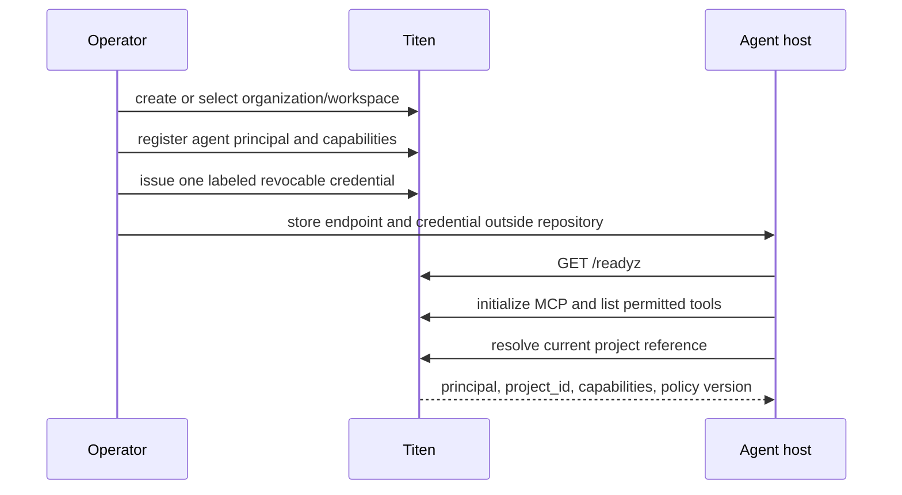
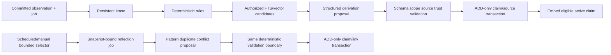
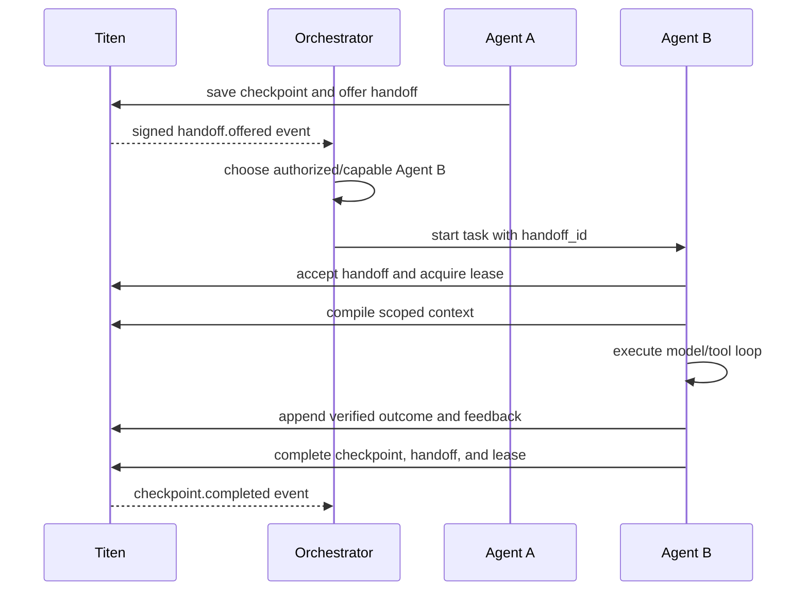

# Agent integration and orchestration flow

- Status: REST, stateless `/mcp`, portable Agent Skill, native Codex/Claude/
  Cursor/Hermes/Pi packages, and OpenClaw/OpenCode/Windsurf/TRAE host kits
  implemented
- Last researched and verified: 2026-07-31
- Audience: agent integrators, operators, contributors, and orchestrator authors
- Applies to: Codex, Claude Code, ZCode, OpenClaw, Cursor, Hermes Agent, Pi,
  OpenCode, Windsurf, TRAE, and other MCP/HTTP-capable agents

## Direct answer

Titen should expose **one memory protocol** and use thin client adapters. It
should not build a separate memory engine for every agent runtime.

```text
OpenClaw ─┐
Hermes  ──┤
Codex   ──┼─ MCP tools or REST client ─ Titen HTTP domain contract
Claude  ──┤                                  │
Pi/Other ─┘                                  ├─ canonical SQL + FTS
                                               ├─ optional async models/vectors
                                               └─ durable event outbox
```

The canonical cross-host distribution unit is the portable Agent Skill under
`.agents/skills/titen-memory/` plus the existing remote `/mcp` endpoint. Exact
copies are bundled where a host cache cannot reference the repository copy;
the focused integration test rejects divergence. Codex, Claude/ZCode, Cursor,
Hermes, and Pi receive their native packaging shape. OpenClaw receives a
ClawHub skill bundle plus native remote-MCP config; OpenCode, Windsurf, and TRAE
receive the native MCP/skill configuration their host supports. The complete
install matrix is in [Agent plugins](../agent-plugins.md).

A future lifecycle adapter may additionally contain:

1. a Streamable HTTP MCP connection to Titen;
2. a short instruction describing when to recall and remember;
3. narrowly scoped lifecycle hooks for context injection, bounded flush, and
   coordination, only after that host has a parity fixture;
4. no embedded database, model SDK, or duplicate memory policy.

REST remains the universal fallback. The plugin, hook, SDK, and MCP tools all
reuse the same authorization, validation, and domain operations.

The distribution decision is to publish thin host artifacts without publishing
host-specific memory implementations. Native packages are installation
conveniences; authorization, scope, evidence, recall, and coordination policy
remain in the one Titen service. No package currently adds lifecycle hooks.

## Endpoint correction

Use one of these shapes:

- local machine: `http://127.0.0.1:8787`;
- named local host, only after configuring it: `http://titen.localhost:8787`;
- VPS or private network: `https://memory.example.internal`;
- Cloudflare deployment: an operator-owned HTTPS hostname.

`titen.127.0.0.1` is not a normal local hostname and should not appear in
installation examples. The MCP endpoint is `/mcp`; the REST API remains
under `/v1`.

Never put a Titen key in a repository file, plugin manifest, tool description,
URL query, or command-line argument. Each agent receives a distinct revocable
credential through its runtime's secret or environment configuration.

## What each layer owns

| Layer               | Owns                                                    | Must not own                   |
| ------------------- | ------------------------------------------------------- | ------------------------------ |
| Agent runtime       | model loop, tools, local conversation, user interaction | canonical shared memory        |
| Titen adapter       | transport, lifecycle mapping, buffering, idempotency    | classification policy or truth |
| MCP surface         | small stateless tool contract                           | durable session state          |
| Titen kernel        | evidence, claims, retrieval, context, feedback          | agent selection or execution   |
| Collaboration plane | checkpoints, leases, handoffs, visibility               | workflow scheduling            |
| Orchestrator        | agent selection, queues, retries, deadlines, workflows  | rewriting canonical evidence   |
| Event delivery      | durable post-commit notifications                       | synchronous memory writes      |
| Memory Atlas client | read-only operator visualization                        | agent memory tools or policy   |

Titen is the state and coordination plane. OpenClaw, Hermes, an internal
dispatcher, CI, or another service may be the orchestrator.

A CRM/chatbot gateway is a different service profile: it compiles only
channel-approved release context and optional server-resolved customer context.
It does not receive ordinary memory-management or administrative MCP tools.

## One install model, several host adapters

The installation experience can differ while the memory behavior stays the
same.

| Runtime | Shipped distribution | Tool connection | Lifecycle automation |
| --- | --- | --- | --- |
| Codex | repo-marketplace plugin | user `config.toml` remote MCP | deferred |
| Claude Code / ZCode | Claude marketplace bundle | bundled environment-backed HTTP MCP | deferred |
| OpenClaw | ClawHub compatible bundle + config kit | native `mcp.servers` remote MCP | deferred |
| Cursor | Cursor marketplace plugin | bundled environment-backed HTTP MCP | deferred |
| Hermes Agent | Python skill plugin | native `mcp_servers` config | deferred |
| Pi | skill-only Pi package | operator-selected MCP adapter | deferred |
| OpenCode | Agent Skill + config kit | native remote MCP | deferred |
| Windsurf | model-decision rule + config kit | native remote MCP | deferred |
| TRAE | Agent Skill + UI recipe | native remote MCP UI | deferred |
| Generic MCP client | Agent Skill | Streamable HTTP `/mcp` | host-specific |
| Any stdio host, no service | CLI only | `titen mcp` in-process over stdio; no HTTP, no key | host-specific |
| Agent without MCP | short instructions | `TitenClient`/REST | explicit calls |

Every "remote MCP" row above can also be reached through `titen mcp`, which is
the single command for both entry points: with `TITEN_MCP_URL` and
`TITEN_API_KEY` both set it bridges stdio to that served instance, with neither
set it serves the local `~/.titen/memory.db` store in-process, and with exactly
one set it throws rather than guessing. The CLI is a Bun program and requires
Bun on `PATH`.

## Verified host matrix and packaging decision

The matrix is grounded in current primary host documentation. Claude
[marketplaces](https://code.claude.com/docs/en/plugin-marketplaces), Cursor's
[plugin specification](https://github.com/cursor/plugins), OpenClaw's
[bundle mapping](https://docs.openclaw.ai/plugins/bundles), Hermes
[plugins](https://hermes-agent.nousresearch.com/docs/user-guide/features/plugins),
Pi [packages](https://pi.dev/docs/latest/packages), OpenCode
[MCP](https://opencode.ai/docs/mcp-servers), Windsurf
[MCP](https://docs.windsurf.com/windsurf/cascade/mcp), ZCode
[plugins](https://zcode.z.ai/en/docs/plugin), and TRAE's
[skill support](https://www.trae.ai/changelog) each use a different packaging
or configuration surface. The repository therefore ships several tiny
artifacts rather than one dishonest polyglot plugin.

One source repository may generate several artifacts, but one polyglot native
plugin cannot be honest across JSON bundles, TypeScript/npm extensions,
OpenClaw's runtime API, and Hermes' Python API. Every future adapter must reuse
the same nine MCP tools or REST operations and pass a host-specific install,
authorization, lifecycle, and outage smoke.

Automatic recall, transcript capture, and lifecycle flush are intentionally not
part of Titen's agent packages. Memory access stays explicit, scoped, and
reviewable. Pi therefore remains a skill package paired with an
operator-selected MCP adapter instead of receiving ambient process authority.
Public catalogs are distribution channels, not runtime requirements: Titen
submits a package only where the vendor documents a self-service path and keeps
the other supported hosts on the direct-install matrix below.

### Runtime notes

**OpenClaw.** Install the compatible bundle from ClawHub. Current OpenClaw maps
its skill and remote HTTP `.mcp.json` into the embedded agent without loading an
in-process provider. The shipped `integrations/openclaw/openclaw.json` fragment
remains the explicit native-config fallback.

**Hermes Agent.** The Python plugin registers the read-only skill and native
`mcp_servers` configuration owns the connection. Hermes displays canonical wire
tool names with an `mcp_titen_` prefix, which the skill recognizes. It is not a
Hermes memory-provider implementation.

**Codex.** Install the skills-only reference plugin, then register the
Streamable HTTP server in user-level `~/.codex/config.toml`, or project config
only for a trusted repository. Codex currently treats a plugin `.mcp.json` URL
literally, so Titen does not embed `TITEN_MCP_URL` or a localhost/public instance.
Add a lifecycle hook only after automatic recall/flush has a parity fixture.

## Shipped Codex reference plugin

Install the repository marketplace and plugin:

```bash
codex plugin marketplace add RamaAditya49/titen --ref main \
  --sparse .agents/plugins --sparse plugins/titen-memory
codex plugin add titen-memory@titen
```

Configure the operator-selected instance separately after setting
`TITEN_MCP_URL` and `TITEN_API_KEY` in the host's secret-aware environment:

```bash
codex mcp add titen --url "$TITEN_MCP_URL" \
  --bearer-token-env-var TITEN_API_KEY
codex mcp get titen --json
```

The plugin contains only its manifest and portable skill. It chooses no URL,
contains no credential, starts no process, and adds no lifecycle hook. The
server remains the existing authenticated Titen deployment.

**Claude Code/ZCode.** Install the native Claude marketplace bundle. ZCode can
import the same GitHub marketplace source.

**Cursor.** Install the native Cursor marketplace plugin. Its `mcp.json` uses
Cursor's `${env:NAME}` interpolation, distinct from Claude's `${NAME}` syntax.

**Pi.** Install the skill-only Pi package and connect Titen through the adapter
selected by the operator. The package intentionally has no extension code with
ambient process authority.

**Other agents.** If they support remote MCP, they receive the same tools over
Streamable HTTP. If they support only local stdio MCP, run `titen mcp` with
`TITEN_MCP_URL` and `TITEN_API_KEY` inherited from the host's secret-aware
environment. Otherwise a tiny REST client implements the same operations. An
`AGENTS.md`, `CLAUDE.md`, or equivalent file should contain usage rules, not
credentials or a large dump of recalled memory.

## MCP configuration examples

These examples target the shipped `/mcp` contract. They require a running Titen
deployment and an operator-issued key. Keep environment values in mode-`0600`
host configuration or the runtime's secret store.

### OpenClaw

```json5
{
  mcp: {
    servers: {
      titen: {
        url: "${TITEN_MCP_URL}",
        transport: "streamable-http",
        headers: { Authorization: "Bearer ${TITEN_API_KEY}" },
        toolFilter: {
          include: [
            "titen_project_resolve",
            "titen_remember",
            "titen_consolidate",
            "titen_compile",
            "titen_feedback",
            "titen_checkpoint_save",
            "titen_checkpoint_get",
            "titen_lease_acquire",
            "titen_handoff",
          ],
        },
      },
    },
  },
}
```

After saving, the operator should run OpenClaw's MCP doctor/probe and verify the
tool allowlist. Lifecycle hooks remain deferred.

### Hermes Agent

```yaml
mcp_servers:
  titen:
    url: "${TITEN_MCP_URL}"
    headers:
      Authorization: "Bearer ${TITEN_API_KEY}"
    tools:
      include:
        - titen_project_resolve
        - titen_remember
        - titen_consolidate
        - titen_compile
        - titen_feedback
        - titen_checkpoint_save
        - titen_checkpoint_get
        - titen_lease_acquire
        - titen_handoff
```

Reload/probe the server and verify the tool allowlist. Adapter plugin hooks
remain deferred until a host-specific parity fixture exists.

### Codex

```toml
[mcp_servers.titen]
url = "http://127.0.0.1:8787/mcp"
bearer_token_env_var = "TITEN_API_KEY"
enabled_tools = [
  "titen_project_resolve",
  "titen_remember",
  "titen_consolidate",
  "titen_compile",
  "titen_feedback",
  "titen_checkpoint_save",
  "titen_checkpoint_get",
  "titen_lease_acquire",
  "titen_handoff",
]
default_tools_approval_mode = "writes"
```

Use user-level configuration for the credential-bearing connection. The shipped
plugin bundles the skill only; lifecycle hooks remain deferred and the key must
not enter its manifest.

### Claude Code

```json
{
  "mcpServers": {
    "titen": {
      "type": "http",
      "url": "${TITEN_URL}/mcp",
      "headers": {
        "Authorization": "Bearer ${TITEN_API_KEY}"
      }
    }
  }
}
```

The shipped Claude marketplace bundle includes this MCP declaration and the
portable skill. The secret remains an environment value supplied by the
installer/operator; lifecycle hooks remain deferred.

### Generic REST fallback

An agent that cannot use MCP needs only the same endpoint/key plus four kernel
operations at first: project resolve, context compile, observation batch, and
feedback. Checkpoint/lease/handoff calls activate when collaboration is needed.
The reference CLI should read JSON from stdin and print JSON to stdout so any
host hook can use it without an SDK dependency.

### In-process Bun mode

A benchmark, an evaluation harness, or an embedding host that already runs on
Bun does not have to pay a loopback round trip. `serve()` returns the same
handler the socket serves, and `TitenClient` accepts a `fetch` implementation,
so the client can call the kernel directly:

```ts
import { serve } from "titen-memory/bun";
import { TitenClient } from "titen-memory";

const { app, stop } = await serve({
  dbPath: "./titen.db",
  port: 0,
  hostname: "127.0.0.1",
  quiet: true,
});
const titen = new TitenClient({
  url: "http://embedded.invalid",
  key,
  fetch: (input, init) => app(new Request(input, init)),
});
```

The URL is never dialled; it only supplies the origin the client builds paths
against. Authentication, scopes, and every response envelope are identical
because it is the same handler — this mode removes the transport, not the
contract. `port: 0` still binds an ephemeral listener that nothing connects to,
and `stop()` closes it together with the database.

The subpath is exported under the `bun` condition only. On Node it fails with
`ERR_PACKAGE_PATH_NOT_EXPORTED`, which is honest: this runtime needs
`bun:sqlite`. Node hosts use `titen serve` plus the HTTP client.

## Provisioning flow

An operator performs this once per agent identity:



Rules:

- one principal and credential per agent or service;
- personal mode may provision an internal singleton organization/workspace;
- the server derives organization and principal from authentication;
- the client may propose a project reference but cannot grant itself project
  access;
- installation verifies readiness and tool discovery without writing memory;
- a failed optional vector/model capability may be degraded, but canonical SQL
  and FTS must be ready.

## Project resolution

The agent normally knows the repository more reliably than a memory classifier.
It should resolve project scope deterministically:

1. find the repository root;
2. read the Git origin without credentials or query parameters;
3. normalize a hosted origin to lowercase `owner/repo` when unambiguous;
4. otherwise use an operator-approved stable project slug;
5. call `titen_project_resolve` under the authenticated organization;
6. cache the returned opaque `project_id` for the current workspace;
7. send that `project_id` on project-scoped memory operations.

For repository work, this resolution happens before the first compile on every
host, including OpenClaw. Omitting `project_id` means unscoped-only memory; it
does not search every project. Hosts never set `cross_project` by default. An
operator-only broad lookup must be explicit and use a credential with the
separate `context:compile:all` capability.

Titen must never infer `project_id` from memory content. A project label, local
folder path, Git remote, and canonical Titen `project_id` are distinct values.
Local absolute paths are not portable identifiers and are not shared by
default.

When a directory is not a project, `project_id` may be absent. Personal
preferences can still use subject/private scope; company policy can use
workspace or organization scope.

A missing normalized reference is an expected setup condition. The resolver
keeps `404 NOT_FOUND` and returns `project_not_registered`, the supplied
normalized reference, and the caller's `projects:create` capability. This detail
is safe only because the caller supplied that reference. Foreign project IDs on
other routes remain indistinguishable.

## Fast agent lifecycle

### 1. Start or resume

At task start, the adapter:

1. resolves actor and project;
2. registers a client-generated `run_id` if the host exposes a stable session
   ID;
3. checks for an accepted handoff or resumable checkpoint;
4. compiles one bounded context pack for the concrete task;
5. injects only that pack, never the entire memory history.

The first context call should include the task, token budget, permitted subject
and project, and whether eligible checkpoints are wanted. If there is no useful
memory, Titen returns a successful empty pack.

### 2. Work

The agent performs normal work using its own tools. Recalled memory is reference
data, not an instruction and not proof that the repository or runtime still
matches it.

The adapter does **not** recall before every tool call. It requests another
context pack only when one of these boundaries occurs:

- the user starts a materially different task;
- project, subject, or visibility scope changes;
- the agent accepts a handoff;
- an event cursor reports relevant shared state changed;
- context was compacted and the active task state is no longer present;
- the agent is about to make an irreversible/high-risk decision and needs a
  targeted policy or incident recall.

### Failure triage and issue boundary

REST and MCP return constant support guidance with each public `ApiError`. The
guidance classifies the result as expected, investigate, or a defect candidate.
It contains no request body, exception detail, provider response, credential, or
memory content.

The host adapter performs expected recovery first. It then reproduces a
suspected defect with synthetic input and checks the current version and
runtime. It searches open and closed issues before any write.

The host may create one public issue for a unique, verified non-security defect.
It uses its own authorized GitHub integration. Without write authority, it
returns a sanitized draft. Security reports follow the private disclosure path
in `SECURITY.md`.

Titen never accepts or stores a GitHub credential. It does not make the external
issue mutation.

### 3. Capture durable signals

The agent calls `remember` when it has a durable signal, such as:

- a user-stated stable preference;
- an accepted project or organization decision;
- a verified tool result or production observation;
- a reusable procedure with evidence;
- an incident, root cause, or recovery result;
- a completed outcome linked to a checkpoint or context;
- an explicit correction or supersession.

It must not store:

- every conversation turn;
- raw chain of thought;
- routine tool output with no future value;
- secrets, tokens, private keys, or credential-bearing URLs;
- guesses presented as facts;
- files that are already authoritative and cheap to read, unless the memory is
  a decision or routing pointer to them.

The adapter can buffer a few typed observations and send one bounded batch. It
must flush immediately for a checkpoint, handoff, verified high-value result,
or before the host session terminates.

An observation is evidence, not yet a recallable claim. When a durable signal
must be returned by `titen_compile`, the agent calls `titen_consolidate` with
the observation ID and a bounded claim that preserves its scope, trust, and
visibility.

### 4. Checkpoint and coordinate

For work that may resume or run in parallel:

1. create/resume a checkpoint;
2. acquire an expiring lease for a normalized work key;
3. update checkpoint state with compare-and-swap versioning;
4. store durable findings as observations, not only checkpoint text;
5. release/complete the lease, or offer a handoff with the checkpoint and
   visible evidence IDs.

Checkpoints are task state. They do not become semantic facts through
similarity or repetition.

### 5. Finish and learn

At successful or failed task completion, the adapter:

1. flushes pending typed observations;
2. records context/item feedback when use can be determined;
3. records a verified outcome when one exists;
4. saves the final checkpoint state;
5. completes/releases the lease;
6. completes or creates a handoff when responsibility changes.

An end hook performs a bounded flush. It does not upload the whole transcript
or wait for embedding, consolidation, or webhook delivery.

## Context read path

```text
task + actor + project + budget
        │
        v
authorize scopes before search
        │
        ├─ SQL filters and exact lookup
        ├─ FTS candidates
        └─ optional query embedding + vector candidates
                    │
                    v
             deterministic rank fusion
                    │
                    v
            canonical SQL hydration
                    │
                    v
       time/trust/conflict/utility/diversity
                    │
                    v
          smallest sufficient context pack
```

Performance rules:

- exact/structured and FTS paths are always available;
- FTS and vector candidate work may run in parallel when vectors are enabled;
- an implementation may skip vector work for a high-confidence exact lookup
  only after an ablation proves no required quality regression;
- candidate limits and token budgets are bounded;
- canonical hydration and authorization always run after derived-index search;
- context responses carry a version/ETag candidate so an adapter can avoid
  reinjecting unchanged context;
- raw prompts are not stored by default.

## Write acknowledgement path

The synchronous path stays deliberately short:

```text
authenticate
  → authorize scope
  → validate and normalize bounded input
  → check idempotency
  → one SQL transaction:
       observation + history + FTS + direct claim/source + outbox
  → return canonical acknowledgement
```

The request path must not wait for:

- an extraction or classification model;
- embedding generation;
- vector upsert visibility;
- webhook delivery;
- consolidation across older records;
- an orchestrator decision.

This gives Titen a stable fast path even when every optional dependency is
slow or unavailable.

## Asynchronous enrichment path

This is the implemented ADR-0004 opt-in path. Configured maintenance drains a
separate durable enrichment job; without the extraction tuple, observation rows
remain canonical evidence and no model call occurs:



Deterministic classification runs first. A model proposes only what cannot be
derived safely. Every proposal cites supplied source or premise IDs and passes
schema, scope, trust, temporal, authority, and bounded-output validation. Model
confidence does not set trust or decide whether a dispute is resolved.
Derivation enqueue is atomic with its observation. Reflection enqueue is a
separate idempotent scheduler transaction over ordered premise versions and a
policy snapshot; an ordinary claim commit does not automatically create it.

Embedding targets the active compact claim version by default, not every raw
turn or tool response. The observation FTS projection exists, but the current
context compiler retrieves claims only; pending enrichment must therefore be
reported as not claim-ready rather than silently treated as recalled memory.

## Memory attribution: who, what, and where

“Owner” is too ambiguous for a safe memory schema. Titen records separate
dimensions:

| Dimension         | Question                                  | Source of truth                    |
| ----------------- | ----------------------------------------- | ---------------------------------- |
| `organization_id` | Which isolation boundary owns the record? | authentication                     |
| `workspace_id`    | Which collaboration space may use it?     | membership/policy                  |
| `project_id`      | Which explicit project does it apply to?  | resolved project scope             |
| `subject_id`      | Who or what is the memory about?          | caller-selected authorized subject |
| `actor_id`        | Who caused this write?                    | authentication                     |
| `observer_id`     | Whose perspective does a claim represent? | explicit authorized field          |
| `agent_id`        | Which software agent produced/used it?    | authenticated/run context          |
| `run_id`          | Which session/task run produced it?       | client correlation ID              |
| `visibility`      | Who may retrieve it?                      | explicit policy-checked value      |
| `created_by`      | Which principal created this version?     | authentication                     |

A record can be about a service, authored by an agent, scoped to a project, and
visible to a team. Those are not one “entity owner” field.

## Classification contract

Classification answers different questions with different fields:

| Axis             | Initial values                                                                                     | Purpose                   |
| ---------------- | -------------------------------------------------------------------------------------------------- | ------------------------- |
| Observation kind | `user_statement`, `tool_result`, `imported_source`, `decision`, `system_event`                     | what evidence arrived     |
| Claim kind       | `semantic_fact`, `episodic_event`, `preference`, `procedural`, `decision`, `relationship` | what durable memory means |
| Trust            | `unverified`, `asserted`, `verified`, `policy_approved`                                            | evidence authority        |
| Lifecycle        | `active`, `disputed`, `superseded`, `expired`, `revoked`                                           | current eligibility       |
| Visibility       | `private`, `team`, `organization`                                                                  | who may retrieve it       |
| Validity         | `valid_from`, `valid_to`                                                                           | when it applies           |
| Subject type     | `human`, `agent`, `service`, `organization`, `repository`, `artifact`, `system`, `concept`         | what the subject is       |

The caller supplies the known kind and scope on the current direct path. Titen
validates it. The planned automatic path fills claim proposals asynchronously;
it never widens visibility, raises trust, changes project, publishes memory,
deletes evidence, or resolves a dispute.

### Tags

Tags are optional normalized labels for filtering, navigation, and ranking.
They are not authorization, truth, trust, or lifecycle.

Recommended shape:

```text
topic:deployment
artifact:api
risk:security
status:blocked
language:typescript
```

Rules:

- lowercase namespace and value;
- bounded count and length;
- exact normalized uniqueness per organization;
- user and system-generated provenance retained;
- aliases are explicit rather than silently rewriting old tags;
- automatic tags remain proposals until their validator permits activation;
- no arbitrary tag may grant visibility or policy capability.

Do not create an ontology service or knowledge graph for the first release. A
small `tags` plus `record_tags` relation is enough when tag filtering enters an
accepted feature slice.

### Subjects and entity references

`subject_id` is the canonical “memory is about this entity” reference. A subject
may have bounded aliases or external references, such as a repository slug or
service identifier. Claims of kind `relationship` connect subjects through
evidence-backed predicates.

Entity extraction is optional enrichment. Mention detection may create a
candidate link, but only an authorized, validated subject link becomes
canonical. Entity similarity never merges two people, agents, repositories, or
services automatically.

This SQL-first subject/relationship model covers the initial need without a
graph database. Memory Atlas may expose bounded authorized SQL projections for
operator diagnosis in v0.2. Add dedicated graph storage or traversal
infrastructure only when measured workloads cannot be met by indexed SQL joins.

## MCP tool surface

Keep the default agent surface small and unambiguous. Eight semantic families
map to the nine wire tools that are actually shipped:

| Family       | Shipped wire tool(s)                                      | Use                                      |
| ------------ | --------------------------------------------------------- | ---------------------------------------- |
| project      | `titen_project_resolve`                                   | resolve stable project reference         |
| context      | `titen_compile`                                           | compile bounded task context             |
| remember     | `titen_remember`                                          | append one typed durable observation     |
| consolidate  | `titen_consolidate`                                       | materialize evidence-linked claims       |
| feedback     | `titen_feedback`                                          | record recall outcomes                   |
| checkpoint   | `titen_checkpoint_save`, `titen_checkpoint_get`           | save or read resumable state             |
| lease        | `titen_lease_acquire`                                     | acquire or renew bounded work ownership  |
| handoff      | `titen_handoff`                                           | offer work to another principal          |

Administrative key, membership, retention, and webhook-subscription operations
are not exposed to ordinary agent profiles by default.

Memory Atlas is not an ordinary-agent MCP tool. Authorized
operator clients compile read-only views through
`POST /v1/memory-views/compile`; agents continue to use the eight focused
families above.
Channel/release administration is also excluded. Publisher, approver, and
gateway credentials use the narrower REST operations and capabilities defined
in the API reference.

MCP is stateless with respect to durable agent sessions. Tool input contains
the explicit run/project/task references needed for the operation, while actor
and tenant come from authentication. A disconnected MCP client loses no
canonical Titen state.

## Hook contract

Host event names differ, so adapters map them to a small Titen lifecycle:

| Titen lifecycle | Typical host events                                   | Required behavior                                  |
| --------------- | ----------------------------------------------------- | -------------------------------------------------- |
| `session_start` | SessionStart, `on_session_start`, agent/session start | resolve project; optional bounded context          |
| `task_prompt`   | UserPromptSubmit, `pre_llm_call`, prompt-build hook   | compile/refresh context when task changed          |
| `tool_result`   | PostToolUse, `post_tool_call`                         | capture only allowlisted durable candidate types   |
| `agent_finish`  | Stop, `post_llm_call`, agent end                      | flush batch, feedback, checkpoint                  |
| `session_end`   | SessionEnd, `on_session_finalize`                     | final bounded flush and lease handling             |
| `subagent_end`  | SubagentStop, `subagent_stop`                         | outcome/checkpoint/handoff, no raw transcript copy |

Default hook behavior is fail-open for optional recall/capture and fail-closed
for authorization or destructive policy enforcement. A Titen outage may remove
memory assistance, but it must not make the host report a memory write as
durable.

Hook budgets are intentionally small:

- context hook: one bounded network call with explicit timeout;
- capture hook: local validation and buffer append only;
- finish hook: one batch flush plus checkpoint/feedback requests;
- no hook model call;
- no recursive call where a hook observes its own Titen MCP operation.

## Events, webhooks, and orchestration

### CRM and public-channel flow

Customer-facing applications remain outside Titen:

```text
customer → CRM/chatbot gateway → authenticated channel context → answer
                                  ├─ active approved release snapshots
                                  └─ optional authenticated-customer context
```

The operator pins the gateway credential to allowed `channel_id` and audience.
The gateway cannot turn `verified` memory into a release, select an arbitrary
customer subject, or search internal canonical memory. Authenticated-customer
context uses a short-lived signed assertion bound to channel/audience, expiry,
and replay protection. Release management is an audited publisher/approver
operation; activation and revocation emit metadata events after commit.

### When a webhook is needed

Use a webhook when another long-running service must wake or react after a
canonical state change. Do not send a webhook for every observation or every
retrieval.

Initial useful event types are:

- `handoff.offered`, `handoff.accepted`, `handoff.completed`;
- `lease.expiring`, `lease.expired`, `lease.released`;
- `checkpoint.blocked`, `checkpoint.completed`;
- `claim.disputed`, `claim.approved`, `claim.revoked`;
- `semantic.ready`, `semantic.failed`;
- `delivery.failed` for operator visibility;
- `knowledge_release.activated`, `knowledge_release.replaced`,
  `knowledge_release.suspended`, `knowledge_release.expired`, and
  `knowledge_release.revoked` when v0.3 channel serving is enabled.

### Where it goes

The destination is an explicit operator-created subscription scoped to an
organization, workspace, project, or v0.3 channel. Typical destinations are:

- an OpenClaw or Hermes gateway;
- a company agent dispatcher;
- a CI/workflow service;
- an internal event bridge;
- an observability/incident service.

Titen never guesses a webhook destination from memory, tags, or model output.
Ephemeral CLI agents should normally poll/list pending handoffs or receive work
through their orchestrator rather than expose their own webhook server.

### Delivery contract

```text
canonical transaction
  → append event_outbox row
  → return to caller
  → background delivery worker
  → signed POST with event_id and attempt
  → 2xx acknowledgement or bounded retry/backoff
  → dead-letter/operator state after retry limit
```

Required controls:

- HTTPS outside loopback/private test environments;
- HMAC signature, timestamp, and replay window;
- opaque `event_id` as receiver idempotency key;
- destination allowlist and SSRF protection;
- bounded body and timeout;
- metadata-only payload by default;
- explicit capability before including memory content;
- retry with jittered exponential backoff;
- delivery attempt history without response-body secrets;
- subscription pause, rotation, and deletion without touching canonical memory.

Webhook failure never rolls back an accepted memory write.

## Orchestrator flow

Titen exposes state; an orchestrator decides who runs.



The orchestrator owns:

- agent capability/capacity selection;
- task queue and priority;
- process/container startup;
- model/provider choice;
- retries, deadlines, and human escalation;
- delivery to user-facing channels.

Titen owns:

- whether the selected agent may access the handoff/project;
- checkpoint version and lease collision control;
- authorized context compilation;
- evidence, outcome, and feedback history;
- durable event delivery state.

Personal mode needs no orchestrator. One agent can call Titen directly. Company
mode typically uses one gateway/dispatcher. Enterprise mode may place an event
bridge between Titen and existing workflow infrastructure without changing the
memory kernel.

## Performance design

The target is not “fewest milliseconds at any cost.” It is the lowest latency
that still returns authorized, evidence-backed, useful context.

### Latency budget boundaries

Measure these separately:

| Span                      | Start                | Stop                                 |
| ------------------------- | -------------------- | ------------------------------------ |
| hook overhead             | host event emitted   | adapter returns to host              |
| canonical acknowledgement | request sent         | SQL/FTS/outbox commit acknowledged   |
| lexical-ready lag         | canonical commit     | item retrievable through FTS context |
| semantic-ready lag        | canonical commit     | current vector version retrievable   |
| context compile           | request sent         | bounded structured pack received     |
| enrichment lag            | canonical commit     | validated claim committed            |
| webhook lag               | domain event commit  | destination 2xx                      |
| orchestration wake        | handoff event commit | selected agent starts                |
| task completion           | agent task start     | verified outcome committed           |
| channel activation lag    | release commit       | release eligible in channel context  |
| channel revocation lag    | revocation commit    | release absent from channel context  |

Report p50, p95, p99, throughput, errors, CPU, memory, storage, model calls,
tokens, and cost. Do not hide model/network time inside a single average.

### Optimizations to test, not assume

1. one context compilation per task boundary versus every turn;
2. explicit durable capture versus full transcript extraction;
3. single writes versus bounded observation batches;
4. active-claim embeddings versus raw observation embeddings;
5. FTS-only, vector-only, and hybrid retrieval;
6. parallel lexical/vector candidates versus staged fallback;
7. conditional context via ETag/version versus unconditional reinjection;
8. webhook wake versus polling intervals;
9. direct agent calls versus host plugin/hook overhead;
10. one, eight, and thirty-two concurrent agents with lease contention.

An optimization ships only when it preserves the declared retrieval, evidence,
scope-isolation, conflict, and task-success floors.

### Adapter benchmark matrix

Run the same canonical fixture through each adapter:

```text
install/probe
  → resolve project
  → compile context
  → remember typed observation batch
  → checkpoint + lease
  → handoff
  → feedback/outcome
  → disconnect/reconnect
```

For each agent host, publish:

- host and adapter version;
- connection type and location;
- enabled Titen tools;
- lifecycle events used;
- hook overhead p50/p95/p99;
- calls and bytes per completed task;
- duplicate and dropped mutation count;
- context tokens injected;
- reconnect/retry behavior;
- task success and action efficiency;
- raw trial output.

Do not claim one agent integration is faster when it skipped a required write,
evidence link, authorization check, or lifecycle step.

## Reliability and safety checklist

- [ ] Every agent uses a distinct revocable credential.
- [ ] Credentials are outside source control and absent from URLs/logs.
- [ ] Tenant and actor come from authentication, never request metadata.
- [ ] Project resolution strips credentials and is explicit.
- [ ] Expected errors recover before any defect report.
- [ ] Verified defects are sanitized and deduplicated before a host-owned issue.
- [ ] GitHub credentials never enter Titen configuration, memory, or logs.
- [ ] Every mutation has a retry-safe idempotency key.
- [ ] Hook recursion is prevented.
- [ ] Raw transcript and chain of thought are not auto-captured.
- [ ] Context is bounded and labeled as untrusted reference data.
- [ ] SQL/FTS remains functional without model/vector services.
- [ ] Optional enrichment and webhooks run after commit.
- [ ] Private memory cannot become shared through tags or similarity.
- [ ] Verified/internal memory cannot become externally released without an
      explicit approved snapshot.
- [ ] Anonymous channel context cannot select a customer subject.
- [ ] Agent shutdown flush has a short bounded timeout.
- [ ] Leases expire and checkpoints survive process restarts.
- [ ] Webhook destinations are allowlisted and signed.
- [ ] Audit and delivery logs contain IDs/metadata, not memory content.

## Minimal release sequence

1. **P0:** REST contract, project reference rules, typed remember/context,
   idempotency, and adapter benchmark fixture.
2. **v0.1:** one reference CLI/SDK, bounded batching, private checkpoints, and
   lifecycle instructions usable by any agent.
3. **v0.2:** Streamable HTTP MCP, one reference plugin, shared checkpoints,
   leases, handoffs, event outbox, and signed webhooks.
4. **v0.3:** governed channel/audience releases and one generic gateway contract;
   no public canonical-memory endpoint.
5. **Later:** additional host packages only after parity tests; enterprise event
   bridges only after a real operator requirement.

This sequencing proves one real vertical path before creating a client package
matrix.

## Official implementation references

- [Model Context Protocol architecture](https://modelcontextprotocol.io/docs/learn/architecture)
- [OpenClaw MCP registry](https://docs.openclaw.ai/cli/mcp)
- [OpenClaw hooks](https://docs.openclaw.ai/automation/hooks)
- [OpenClaw typed plugin hooks](https://docs.openclaw.ai/plugins/hooks)
- [Hermes Agent MCP](https://hermes-agent.nousresearch.com/docs/user-guide/features/mcp)
- [Hermes Agent event hooks](https://hermes-agent.nousresearch.com/docs/user-guide/features/hooks/)
- [Hermes Agent plugins](https://hermes-agent.nousresearch.com/docs/user-guide/features/plugins)
- [Codex MCP](https://learn.chatgpt.com/docs/extend/mcp)
- [Codex hooks](https://learn.chatgpt.com/docs/hooks)
- [Codex plugins](https://developers.openai.com/plugins/)
- [Claude Code MCP](https://code.claude.com/docs/en/mcp)
- [Claude Code hooks](https://code.claude.com/docs/en/hooks)
- [Claude Code plugins](https://code.claude.com/docs/en/plugins)
- [Anthropic: effective context engineering for AI agents](https://www.anthropic.com/engineering/effective-context-engineering-for-ai-agents)

These links document host capabilities. Titen's protocol, data ownership,
classification, webhook, and orchestration decisions are defined by this
repository.
