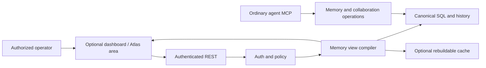

# Memory Atlas

Memory Atlas is Titen's optional read-only observability surface. Its primary
question is not “what does the whole graph look like?” but “why did this agent
remember this, and was it safe to use?”

The accepted boundary is recorded in
[ADR-0003](../decisions/0003-memory-atlas-authorized-projection.md).
Its position inside the progressive operator interface is defined in
[DESIGN](../DESIGN.md).

## Product lenses

| Lens                       | Release | Operator question                                                              |
| -------------------------- | ------- | ------------------------------------------------------------------------------ |
| Evidence Trace             | v0.2    | Which observations support, contradict, or qualify this claim/context item?    |
| Memory Neighborhood        | v0.2    | Which authorized claims, subjects, agents, and contexts are directly related?  |
| Conflict & Freshness       | v0.2    | Which claims are disputed, stale, superseded, expired, or recently changed?    |
| Scope Preview              | v0.3    | What would an explicitly selected principal be eligible to inspect?            |
| Knowledge Release          | v0.3    | Which reviewed snapshot reaches which channel/audience, and from what source?  |
| Constellation/Time Machine | later   | Does large-scale exploration or temporal playback improve measured operations? |

Evidence Trace is the priority. A visually impressive constellation without
provenance, temporal state, or authorization is not sufficient.

## System boundary

The UI is an integration consumer. It cannot import or call D1, SQLite,
Vectorize, `sqlite-vec`, model gateways, or runtime bindings directly. Memory
Atlas may be disabled, omitted from a headless build, or served separately from
the API while remaining in the same repository.

## View compilation

`POST /v1/memory-views/compile` accepts a bounded focus and one supported lens.
The logical request contains:

- lens;
- focus resource type and opaque ID;
- explicit authorized scope selectors when permitted;
- traversal depth plus node/edge limits;
- optional display fields requested by the caller.

The compiler follows this order:

1. authenticate the principal and derive tenant/scope authority;
2. resolve the focus resource without disclosing foreign existence;
3. expand only through relationships allowed for that principal and lens;
4. hydrate current canonical versions and recheck status, validity, visibility,
   evidence permissions, and release eligibility;
5. apply traversal and response limits;
6. return nodes, edges, legend metadata, degradation, and truncation state.

Authorization happens before expansion. Response totals describe only the
authorized candidate set; they cannot reveal that hidden nodes or edges exist.

## Dashboard placement

Atlas is the first and only active area in the implemented Astro dashboard at
`/dashboard/`. The reference shell shows the canonical area map, but every
label besides Atlas is non-interactive and has no route. Displayed records and
runtime state come only from live same-origin health, readiness, and authorized
Atlas responses; disconnected or failed integration shows no fixture data.

The later dashboard may activate Memories and Context under Memory and the
other groups defined in DESIGN. The information map does not change Atlas
authorization or make its labels part of this release. Each label becomes a
control only after its backend contract, authorization, current-build
capability, and separate EARS UI work item are complete.

## Projection contract

The response may contain:

- opaque node IDs and types such as observation, claim, subject, agent,
  context, checkpoint, or knowledge release;
- authorized bounded labels/excerpts when the principal may inspect them;
- typed edges such as supports, contradicts, supersedes, selected-in,
  observed-by, handed-to, or released-as;
- trust, lifecycle, temporal, conflict, and visibility display metadata already
  authorized for the principal;
- an optional derived community/layout hint;
- `truncated` and degraded-capability metadata.

Coordinates, clusters, summaries, and community assignments are disposable.
They are never evidence, never change claim trust, and never grant access. No
canonical graph table is required. An optional cache stores only authorized,
versioned projection results and can be discarded at any time. A cache key
includes the organization, authenticated principal, policy snapshot, lens,
focus, canonical versions, and effective limits; it is never shared across
principals or policy snapshots.

## Security rules

- Foreign or hidden focus IDs return the same non-disclosing response class as
  other protected by-ID operations.
- Every returned edge requires both endpoints and the relationship itself to be
  authorized.
- Raw prompts, embeddings, credentials, and hidden content never enter the
  projection.
- Scope Preview requires explicit preview capability. Preview computes another
  principal's eligibility but does not assume that principal's identity or
  grant the operator access the target would have.
- Knowledge Release shows only release/source metadata the operator may inspect
  and never treats `verified` as publishable.
- Cache, layout, and vector hits are rejected when canonical version, lifecycle,
  visibility, or release checks fail.
- Traversal depth, nodes, edges, label size, execution time, and response bytes
  are bounded before a renderer receives data.

## Visual language

The operator UI keeps meaning stable across lenses:

- observations are evidence points;
- claims are the primary knowledge nodes;
- contexts show what an agent actually received;
- conflicts and invalid lifecycle states use explicit edge/status treatment;
- scope and trust use separate visual channels;
- selected detail appears beside a stable overview instead of relaying out the
  entire graph on every click.

This is presentation guidance, not a core renderer dependency. The frontend
uses Astro, native browser APIs, bounded tabular layouts, and a synchronized
inspector against live authorized results. A later renderer dependency requires
measured need and a revised work spec.

## Release and failure behavior

- P0/v0.1 have no Memory Atlas release requirement.
- v0.2 ships only after evidence, collaboration, and cross-scope fixtures pass.
- the dashboard client keeps only Atlas active and treats the remaining
  canonical area labels as non-interactive orientation;
- v0.3 lenses ship only after policy, customer isolation, and channel-release
  fixtures pass.
- A missing UI or renderer is not a readiness failure for the headless service.
- A disabled or failed projection cache falls back to bounded canonical queries
  or an explicit unavailable/degraded response; it cannot widen scope.
- A view failure cannot mutate memory, feedback, approval, lease, checkpoint,
  or release state.

## Measured expansion triggers

Do not add a graph database, separate repository, stored layout, WebSocket
stream, 3D renderer, or large-graph tile pipeline until measurements show that
bounded request/response views are insufficient. Useful evidence includes
repeated operator diagnosis tasks that cannot be completed, view p95/resource
failure at the approved data cap, or independently owned UI releases that block
the server release cadence.
