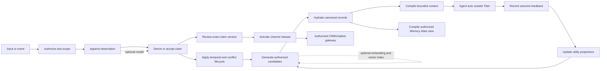
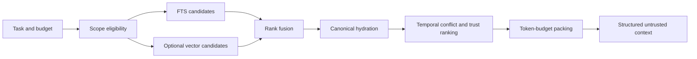
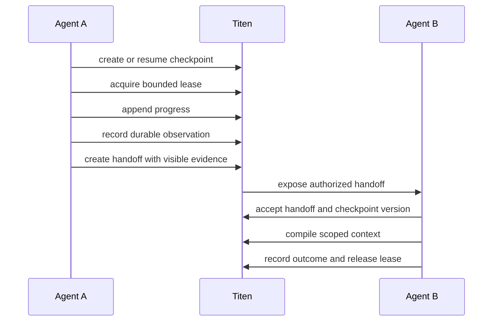
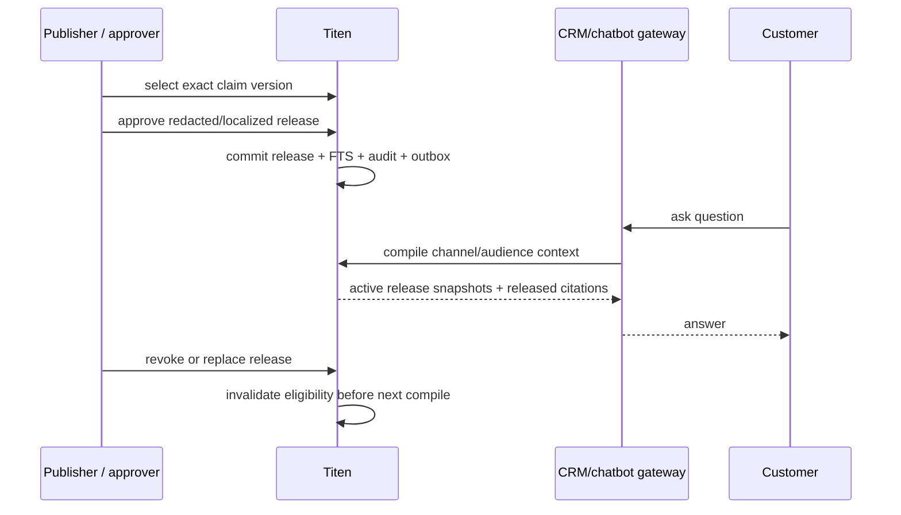

# Titen memory lifecycle protocol

- Status: architecture with current behavior and proposed features explicitly
  labelled
- Audience: contributors, integrators, evaluators, and operators
- Product: Level 6 collaborative memory fabric
- Kernel: Level 5 evidence-grounded context memory

The host-facing install, hook, project, webhook, and orchestrator sequence is
defined separately in the
[agent integration flow](./agent-integration.md).

## Why this exists

Agents do not become more capable merely because more text can be retrieved.
They improve when the right evidence reaches the right actor at the right time,
under the right authority, in a form that is small enough to use and clear
enough to challenge.

Titen exists to make agents:

- **more effective:** relevant decisions, facts, procedures, and task state are
  available for the next action;
- **faster:** retrieval and context packing avoid replaying entire histories;
- **more stable:** canonical evidence survives model, vector, process, and
  network failures;
- **more adaptive:** downstream outcomes influence future selection without
  silently rewriting the past;
- **safer together:** personal, team, and organization memory stays separated
  by identity, scope, visibility, and policy.
- **safe to serve:** customer-facing channels receive only explicitly approved
  release snapshots, never raw canonical memory.

This is a memory lifecycle, not merely RAG over conversation chunks. Retrieval
is one stage. The full system observes, derives, validates, recalls, compiles,
coordinates, learns from outcomes, and preserves an audit trail.

## What memory means in Titen

| Mechanism                | Question it answers                                          | Titen role                           |
| ------------------------ | ------------------------------------------------------------ | ------------------------------------ |
| SQL and FTS              | “Which authorized records contain these terms?”              | mandatory canonical and lexical path |
| Embeddings               | “Which records are semantically close to this task?”         | optional candidate signal            |
| Vector index             | “Which stored embeddings are nearest to this embedding?”     | optional rebuildable index           |
| Claims                   | “What compact, temporal knowledge is supported by evidence?” | Level 5 derived memory               |
| Context compiler         | “What should this actor receive now within this budget?”     | Level 5 decision boundary            |
| Outcome feedback         | “Which selected memory helped or harmed the action?”         | Level 5 adaptation signal            |
| Checkpoints and handoffs | “What work is active, resumable, or transferred?”            | Level 6 collaboration state          |
| Policy and audit         | “Who may see, change, approve, or share this?”               | Level 6 governance boundary          |
| Knowledge release        | “What reviewed snapshot may this external audience receive?” | governed channel distribution        |
| Memory Atlas             | “Why was this memory visible, related, stale, or released?”   | optional read-only observability      |

A vector result is not a fact. A high similarity score is not authority. An
LLM summary is not evidence. All three may help generate candidates, but only
canonical records and explicit policy determine what Titen may return.

## Lifecycle at a glance



Level 5 owns this evidence-to-context feedback loop for one authorized actor.
Level 6 adds shared identity, visibility, checkpoints, leases, handoffs,
conflict handling, governance, and optional federation around the same kernel.

## Canonical concepts

### Observation

An immutable record of something received or verified: a user statement, tool
result, imported source, decision, or system event. It retains origin, actor,
subject, time, trust, visibility, and content hash.

### Claim

A compact and disputable interpretation supported by one or more observations.
A claim has a kind, observer when perspective matters, confidence, trust,
validity interval, version, and lifecycle status.

### Context run

An auditable record of one compilation request: actor, task, authorized scopes,
policy snapshot, token budget, selected items, score components, conflicts, and
degraded capabilities. Raw prompts are not retained by default.

### Outcome feedback

A signal that a context or item was used, useful, irrelevant, incorrect, or
harmful. Feedback changes a bounded utility projection. It does not mutate an
observation or automatically turn popularity into truth.

### Checkpoint

Versioned resumable work state with an owner, bounded payload, status, and TTL.
It is execution state, not durable knowledge.

### Lease

An expiring, retry-safe claim on a bounded work item. It reduces duplicate work
without turning Titen into a scheduler.

### Handoff

An explicit transfer of responsibility that references a checkpoint, visible
evidence, expected next action, sender, recipient, and acceptance state.

### Knowledge release

An immutable approved snapshot of one exact claim version for an
operator-managed channel and audience. Release approval is independent from
claim trust and internal visibility.

## Level 5: evidence-grounded context memory

### Stage 1 — authorize before memory access

**Input:** authenticated principal, requested operation, subject/project/run
references, and visibility.

**Output:** an authorized actor plus eligible scopes and capabilities.

Rules:

1. Organization and tenant authority come from the credential, never from a
   request body.
2. Scope and visibility eligibility are resolved before lexical or vector
   retrieval.
3. An inaccessible identifier is not disclosed through an error, score, count,
   timing optimization, or audit payload.
4. A vector namespace or metadata filter is a performance aid, not the final
   authorization boundary.

### Stage 2 — append evidence first

**Input:** bounded content, kind, subject, source, occurrence time when known,
trust assertion allowed for the caller, and visibility.

**Output:** one immutable observation plus history, FTS projection, and durable
indexing work.

The canonical SQL transaction commits:

- observation content and metadata;
- its append-only history event;
- FTS projection;
- direct claim and source link when supplied and valid;
- one versioned enrichment job when automatic derivation is configured
  (proposed; not present in the current physical schema);
- indexing outbox work when semantic indexing is enabled;
- metadata-only domain event outbox work for subscribed state transitions;
- idempotency result for retry-safe writes.

The request succeeds when canonical SQL succeeds. Embedding or vector failure
does not discard accepted evidence.

```text
validate → authorize → SQL transaction → canonical success
                                     └→ optional index work or outbox
```

### Stage 3 — derive knowledge conservatively

Claims enter the system through two paths:

1. **deterministic:** an authorized caller supplies a claim and evidence links;
2. **model-assisted target:** bounded background derivation proposes claims from
   eligible observations.

Current implementation truth: `POST /v1/consolidations` implements only the
first path and returns `model_used: false`. The indexing outbox does not extract
claims and must not be described as an enrichment queue.

Every proposed claim must pass schema, scope, evidence, trust, and temporal
validation. A model cannot invent a source identifier, increase trust above its
evidence, delete evidence, or resolve a dispute.

The proposed first implementation favors ADD-only derivation. A changed interpretation
creates a new claim version or an explicit lifecycle transition instead of
silently rewriting the old record.

#### Proposed derivation and reflection lanes

```text
observation + enrichment job commit
  → persistent bounded lease
  → deterministic eligibility/exact duplicate rules
  → authorized FTS/embedding candidate shortlist
  → structured derivation proposal
  → local schema/scope/source/trust/time validation
  → ADD-only claim/source/history transaction

bounded authorized claim cluster
  → structured reflection proposal
  → duplicate/conflict/pattern/procedure/supersession validation
  → ADD/link proposal or explicit review; never delete or select truth
```

Derivation handles new evidence. Reflection is slower scheduled work over a
bounded cluster. Both use a model only as a proposal generator. Model names are
not product semantics: the exploratory 2026-07-31 pilot observed the strongest
tested reflection result on the Sol route, but selected no production default
and proved no runtime gate. See the
[dated evaluation report](../research/2026-07-31-memory-model-evaluation.md).

### Stage 4 — preserve time and disagreement

Claims may be:

- `active`;
- `disputed`;
- `superseded`;
- `expired`;
- `revoked`.

Contradictory claims can coexist. Titen distinguishes:

- a factual conflict between sources;
- different observer perspectives;
- a newer decision that explicitly supersedes an older decision;
- a claim whose validity interval ended;
- a revoked claim whose evidence must remain auditable.

No similarity score, majority count, or model response silently declares a
winner. Resolution requires evidence or authorized policy and records the
reasoning boundary as a status transition.

### Stage 5 — generate candidates, not answers

Context compilation begins with the authorized candidate set. Titen can use:

- exact ID and structured filters;
- SQLite FTS5 lexical search;
- optional dense vector similarity;
- explicit recency and temporal validity;
- evidence trust and claim confidence;
- prior bounded utility feedback;
- relevant checkpoints and handoffs;
- conflict and diversity coverage.

The mandatory baseline is FTS-only. When vectors are enabled, lexical and
semantic ranks are fused with a simple deterministic method such as reciprocal
rank fusion. Raw scores from different providers are not assumed comparable.

### Stage 6 — hydrate from canonical SQL

Candidate IDs are reloaded from SQL before use. Hydration rejects:

- foreign or no-longer-visible scope;
- deleted, revoked, or superseded versions when not explicitly requested;
- stale vector versions;
- expired checkpoints and leases;
- evidence the actor cannot inspect.

This step prevents an eventually consistent or corrupted derived index from
reviving stale memory or bypassing authorization.

### Stage 7 — compile the smallest sufficient context

The compiler ranks eligible records and packs them under the caller's token
budget. A context item includes enough structure for the agent to reason about
it:

- claim and kind;
- temporal applicability;
- trust and confidence;
- visible evidence references;
- observer when perspective matters;
- conflict and supersession state;
- score components and selection reason;
- explicit untrusted-data labeling.

Packing favors utility and diversity over returning every match. A successful
empty context is better than fabricated memory.



### Stage 8 — close the loop with outcomes

The agent acts outside Titen. It or an authorized observer can later attach an
outcome to the context run or item.

Feedback may affect:

- future utility ranking within an allowed scope;
- procedural guidance promotion proposals;
- harmful or repeatedly irrelevant item suppression;
- evaluation data for retrieval and context policies.

Feedback may not:

- rewrite observation content;
- raise trust without evidence or authority;
- convert repeated opinion into fact;
- cross tenant, subject, or visibility boundaries;
- autonomously delete canonical evidence.

Titen becomes more adaptive by learning which authorized memory helps each
task class. The initial system learns selection utility, not model weights.
Online fine-tuning is outside the kernel until measured data, rollback, and
poisoning controls justify it.

### Stage 9 — maintain without erasing history

Maintenance is bounded and replay-safe:

- expire claims according to validity and retention policy;
- mark supersession and disputes explicitly;
- rebuild FTS and vector projections from canonical records;
- repair pending index mutations from the outbox;
- deliver signed post-commit events without delaying canonical writes;
- compact derived operational data without deleting protected evidence;
- export canonical records without credentials or embeddings by default.

“Forgetting” means an authorized lifecycle or retention action, not a model
silently deciding that evidence no longer matters.

## Level 6: collaborative memory fabric

Level 6 surrounds the Level 5 kernel with shared identity and coordination. It
does not create a second memory store.



### Collaboration flow

1. Authenticate a distinct human, agent, or service principal.
2. Resolve membership, role/capability, project, subject, and visibility.
3. Create or resume a versioned checkpoint.
4. Acquire an idempotent, expiring lease for a bounded work key.
5. Append progress while durable findings enter the Level 5 observation path.
6. Transfer work through a handoff that cites checkpoint and evidence IDs.
7. Preserve factual conflicts and observer-specific perspectives.
8. Compile context separately for each recipient under its authority.
9. Record outcome, audit event, and lease release or expiry.
10. Notify an explicit orchestrator subscription or expose an event cursor when
    another service must react.
11. Federate only when one deployment cannot satisfy ownership or region
    boundaries.

### Collaboration invariants

- Every agent has its own revocable identity.
- Private memory is never eligible merely because it is semantically similar.
- Shared memory requires explicit visibility or authorized promotion.
- Completed work becomes an observation before it can support a claim.
- Checkpoint version conflicts fail instead of overwriting progress.
- A lease reduces silent duplication but never proves task completion.
- A handoff cannot expose evidence its recipient cannot read.
- Majority agreement is not canonical truth.
- Titen records coordination; the caller selects and schedules agents.

## Memory Atlas observability flow

Memory Atlas is a read-only side path over the lifecycle, not another memory
stage. An authorized operator selects one bounded lens and focus; policy filters
before traversal, canonical hydration rechecks current state, and the compiler
returns only authorized nodes, edges, labels, and counts. View compilation does
not change evidence, claims, context, feedback, coordination, or release state.
The optional renderer can be absent without changing headless REST/MCP behavior.

See [Memory Atlas](./memory-atlas.md) for the complete projection and rollout
contract.

## Governed CRM and chatbot knowledge flow



The gateway is an authenticated service principal; the customer never receives
a Titen credential. `anonymous`, `authenticated_customer`, and `partner` are
release audiences, not canonical visibility values.

For an authenticated customer, the gateway supplies only a trusted external
short-lived signed session assertion that Titen validates and maps to an
authorized subject. The compiler may combine active channel releases with that
customer's private eligible context, but maintains separate source classes and
never indexes the private content as a release. Anonymous requests cannot select
`subject_id`.

The release snapshot remains stable even when its source claim changes. A new
claim version needs a new review, and the old release becomes immediately
ineligible. Source dispute, supersession, expiry, or revocation has the same
effect. Revocation, replacement, suspension, channel scope, audience, and
validity are checked from canonical SQL after every FTS/vector candidate lookup.
Live order, payment, balance, and inventory values stay tool/API reads unless
the operator explicitly intends a bounded historical snapshot.

Channel release does not require an additional model. Redaction or translation
may use a model to propose content, but an authorized approval remains required
and the proposal cannot activate itself.

## Embeddings and vector storage

### Direct answer

Titen does **not** require an embedding model to function. It does require one
when semantic vector retrieval is enabled.

An embedding model and a vector backend are different components:

```text
text or task
    ↓
embedding model
    ↓
fixed-length numeric vector
    ↓
Vectorize / sqlite-vec / pgvector
    ↓
nearest vector IDs
    ↓
canonical SQL hydration and context compilation
```

The backend does not understand text by itself. It stores vectors and searches
for nearby vectors. The same compatible embedding model and preprocessing must
be used for indexed records and queries.

### Which features need a model?

| Capability                    | Embedding model | Extraction model  | Vector backend |
| ----------------------------- | --------------- | ----------------- | -------------- |
| append observation            | no              | no                | no             |
| direct claim                  | no              | no                | no             |
| exact and FTS recall          | no              | no                | no             |
| temporal/conflict filtering   | no              | no                | no             |
| context packing               | no              | no                | no             |
| outcome feedback              | no              | no                | no             |
| release draft/approval        | no              | no                | no             |
| channel FTS context           | no              | no                | no             |
| Memory Atlas SQL lenses       | no              | no                | no             |
| channel semantic retrieval    | yes             | no                | yes            |
| semantic paraphrase retrieval | yes             | no                | yes            |
| automatic claim extraction (proposed) | no       | optional          | no             |
| background memory reflection (proposed) | candidate lookup | required when enabled | candidate lookup |
| semantic reranking            | optional        | optional reranker | optional       |
| checkpoints, leases, handoffs | no              | no                | no             |

Embedding and extraction models are independently optional. Enabling semantic
retrieval does not require enabling automatic memory extraction.

### Titen's recommended profiles

| Profile                | Canonical store       | Retrieval                              | Model requirement                      | Intended use                                       |
| ---------------------- | --------------------- | -------------------------------------- | -------------------------------------- | -------------------------------------------------- |
| Core                   | D1 or SQLite          | structured filters + FTS5              | none                                   | mandatory baseline, offline/degraded operation     |
| Cloudflare hybrid      | D1 + Vectorize        | FTS5 + dense vector fusion             | Workers AI or compatible embedding API | serverless semantic recall                         |
| Lightweight VPS hybrid | SQLite + `sqlite-vec` | FTS5 + exact vector fusion             | local or remote compatible embedder    | personal and small-team deployment                 |
| Proposed model-managed | D1 or SQLite          | FTS5 plus optional vector shortlist    | one evaluated extraction model         | asynchronous derivation and reflection             |
| Scale profile          | Postgres + `pgvector` | Postgres FTS + exact/ANN vector fusion | compatible embedder                    | later high-volume or existing-Postgres deployments |

The base VPS remains Bun plus SQLite. `pgvector` is not the default because it
requires operating Postgres and would break the lightweight single-process
goal. It becomes a justified adapter when measured corpus size, concurrency,
operational topology, or existing enterprise Postgres ownership outweighs that
cost.

### Cloudflare path

When semantic retrieval is enabled:

1. Workers AI or another embedding provider converts eligible text to vectors.
2. D1 commits canonical records and an indexing outbox.
3. Vectorize stores only opaque IDs, canonical `org_id`, `subject_id`,
   project-scope metadata, and vector values.
4. A query uses the configured embedder and sends the resulting vector to
   Vectorize with those scope filters applied before top-k selection.
5. Returned IDs are hydrated and authorized again from D1.

Vectorize insert and upsert visibility is asynchronous. Titen therefore treats
mutation acceptance as pending index work, uses an outbox and bounded repair,
and never makes Vectorize the canonical record.

The adapter persists and compares the configured embedding/index fingerprint in
D1 before exposing Vectorize. Readiness inspects only local binding shape and D1
metadata; it does not call Workers AI or Vectorize.

### Lightweight VPS path

`sqlite-vec` keeps vector search in the SQLite process and adds no database
server. Its public project remains pre-v1, so Titen must pin and test an exact
version. The base design assumes exact KNN behavior; any approximate index path
must earn adoption through compatibility, recall, and latency measurements.

The Bun adapter stores the same organization, subject, and project metadata in
the rebuildable `vec0` table and applies it inside the KNN query. Canonical SQL
still re-authorizes returned IDs, but foreign vectors cannot consume the bounded
top-k window before that hydration step.

This path is attractive for small and medium local corpora because deployment,
backup, authorization joins, and canonical hydration stay close to one SQLite
database. Its practical corpus ceiling must be measured with Titen's real
dimensions, filters, and hardware rather than inferred from a synthetic vector
benchmark.

### When `pgvector` earns a place

Add a Postgres adapter only after a measured need such as:

- exact `sqlite-vec` search misses the declared p95 latency budget at the
  required quality;
- concurrent writers or readers exceed the supported SQLite operating model;
- an enterprise already requires Postgres backup, replication, access control,
  and operational tooling;
- HNSW or IVFFlat provides a useful recall/latency tradeoff at the target scale;
- tenant partitioning requirements are better served by Postgres topology.

`pgvector` supports exact search and approximate HNSW/IVFFlat indexes. Approximate
search trades recall for speed, and filtered multi-tenant queries require
specific recall tests. It is a scale option, not a requirement for smarter
memory.

### What gets embedded

Titen's primary semantic unit is the active claim version, not every raw chat
turn.

- Active claims are compact, typed, temporal, and linked to evidence.
- Observations remain canonical and have an FTS projection, but the current
  context compiler searches claims. Pending observations are not claim-ready
  context until a direct or derived claim exists.
- Evidence is retrieved through claim-source links or direct authorized search.
- Checkpoints remain a separate state corpus and are never promoted by vector
  proximity alone.
- Active channel release snapshots may have a separate semantic projection
  keyed by release version and channel/audience. Their source claims and
  customer-private memory are never substituted into that projection.
- Revoked, expired, or superseded claim vectors are removed or rejected during
  canonical hydration.

This reduces embedding calls, index size, duplicate conversational noise, and
the chance that raw instructions dominate semantic similarity. The tradeoff is
that an observation is not context-eligible until a direct or derived claim
exists. The proposed enrichment API must expose that pending state honestly
instead of hiding the delay.

### Embedding fingerprint contract

Current adapters carry a configured model identifier and dimensions. Bun HTTP
and Cloudflare Workers AI share one validator for exact output cardinality,
ordered provider indices when present, dense dimensions, and finite numeric
coordinates. Capability contract version 1 reports embedding separately from
planned extraction/background enrichment, and the deprecated `model` field
mirrors embedding for `0.3.x` compatibility.

Every semantic index is bound to a fingerprint containing:

- provider and model identifier;
- immutable revision when available;
- output dimensions;
- distance metric;
- preprocessing version, including normalization and text formatting;
- Titen semantic-unit schema version.

Startup compares the locally configured contract with migration-13 metadata
without a provider request. Titen does not pad or truncate mismatched vectors.
Changing the fingerprint requires an explicit re-index and fails semantic
readiness until the vector backend is rebuilt, metadata is reset, and claim
index work is requeued.

Canonical export excludes embeddings by default. A destination rebuilds its
semantic projection only with a declared, verified fingerprint. Changing
providers can change retrieval scores without changing evidence, claims, or
record IDs.

The dated pilot found that `embeddinggemma` retrieved all 24 small multilingual
gold targets within top five, but that synthetic result is not a permanent
default, production threshold, or provider-reachability evidence. A production
evaluation must record the available provider/model revision,
dimensions, preprocessing contract, and index configuration.

### Hybrid retrieval

Titen keeps lexical retrieval even when vectors are enabled:

```text
authorized FTS candidates ─┐
                           ├─ deterministic rank fusion
authorized vector IDs ─────┘
                                      ↓
                             canonical hydration
                                      ↓
                         temporal/trust/utility ranking
```

FTS is strong for identifiers, names, error strings, and exact decisions.
Embeddings help with paraphrase and cross-language similarity. Combining both
avoids forcing one signal to solve every retrieval problem.

Reranking remains optional. It adds model latency and cost, so it is considered
only when a measured quality gain exceeds the simplest fusion path.

## Stability and degradation

| Failure                                  | Required behavior                                        |
| ---------------------------------------- | -------------------------------------------------------- |
| canonical SQL write fails                | abort the mutation; no partial success                   |
| embedding provider fails                 | retain canonical write and FTS; leave index work pending |
| vector write is pending                  | keep canonical claim/FTS available; no recent overlay exists today |
| vector query fails                       | return explicit degraded FTS result when policy permits  |
| vector returns stale ID                  | reject during canonical hydration                        |
| proposed extraction returns invalid sources | commit no proposed claims                             |
| proposed extraction times out/rate-limits | retain leased work for bounded retry; expose degradation |
| proposed enrichment lease expires         | reclaim idempotently; create no duplicate claim          |
| context budget cannot fit an item        | omit it and report packing metadata                      |
| feedback is malicious or out of scope    | reject without changing utility                          |
| lease expires                            | make work available; keep checkpoint history             |
| federation is unavailable                | preserve local canonical history                         |
| release cache/vector returns stale ID    | reject by canonical channel/audience/version/status      |
| customer assertion is invalid/replayed   | return no customer context; expose no subject existence  |

## Optimization ledger

These are hypotheses until the evaluation suite measures them.

| Problem                                      | Titen decision                                   | Expected benefit                                   | Tradeoff                                                 | Required evidence                                         |
| -------------------------------------------- | ------------------------------------------------ | -------------------------------------------------- | -------------------------------------------------------- | --------------------------------------------------------- |
| raw history is noisy and expensive           | embed active claim versions, not every chat turn | fewer vectors, lower cost, denser semantic units   | fresh observations may be FTS-only before claim creation | recall and time-to-semantic-ready ablation                |
| unstructured evidence needs interpretation    | bounded background model proposal plus validator | typed, evidence-linked memory without write latency | eventual enrichment and provider cost                    | locked schema/safety/quality and runtime parity gates     |
| vector services fail independently           | SQL/FTS is canonical; vectors are rebuildable    | no lost memory and graceful degradation            | repair/outbox complexity                                 | failure-injection and rebuild test                        |
| exact and semantic queries differ            | fuse FTS and optional vector ranks               | robust exact and paraphrase recall                 | two candidate paths                                      | FTS-only vs vector-only vs hybrid quality/latency         |
| vector filters are not authority             | authorize before retrieval and hydrate afterward | tenant safety and stale-index rejection            | extra SQL read                                           | zero-leak adversarial suite and hydration latency         |
| facts change over time                       | explicit validity, dispute, and supersession     | correct current and historical context             | more lifecycle state                                     | temporal/conflict accuracy                                |
| more context can reduce agent quality        | token-budget compilation with diversity          | smaller, higher-signal context                     | compiler decisions must be explainable                   | useful-context rate, token use, task success              |
| retrieval feedback can self-reinforce errors | bounded utility projection separate from trust   | adaptation without rewriting evidence              | slower promotion                                         | harmful-feedback and poisoning tests                      |
| task state pollutes durable facts            | checkpoints stay separate from evidence          | clean resumability and memory quality              | explicit promotion step                                  | restart, expiry, and promotion tests                      |
| parallel agents duplicate work               | leases and explicit handoffs                     | less collision and clearer ownership               | expiry/version handling                                  | concurrency and stale-write tests                         |
| runtime-specific implementations drift       | one core with thin Cloudflare/Bun adapters       | portable semantics and smaller maintenance surface | lowest-common-contract discipline                        | dual-runtime contract suite                               |
| public serving could expose raw memory       | exact approved release snapshots per channel     | disclosure control and fast bounded serving        | extra release lifecycle and projection                   | zero-leak, revoke-lag, citation, and answer-quality tests |

## Benchmark contract

Performance hypotheses are not product claims. Titen measures the complete
path, not only nearest-neighbor search:

```text
write acknowledgement
time to lexical visibility
time to semantic visibility
release activation and revocation visibility
channel context compilation
query embedding
candidate generation
canonical hydration
context ranking and packing
downstream task success, latency, and action count
```

The public [evaluation specification](../testing/EVALS.md) defines controlled
FTS-only, hybrid, self-hosted comparison, and managed-service lanes. A result is
publishable only with its commit, fixture hash, model fingerprint, database,
hardware/region, dataset size, concurrency, warm/cold state, quality metrics,
p50/p95/p99 latency, throughput, error rate, resource use, and cost.

Titen may claim a speed advantage only at a pre-declared quality and safety
floor. A faster response that loses evidence, hides a conflict, crosses scope,
or returns worse useful context is a failed benchmark.

## Public claim discipline

- “Works without embeddings” means canonical writes, FTS recall, context
  compilation, feedback, and collaboration primitives remain functional.
- “Semantic retrieval enabled” names a locally initialized vector backend whose
  complete configured fingerprint matches migration-13 metadata; it does not
  prove provider reachability until real indexing/query evidence exists.
- “Faster” names the workload, comparison lane, dataset, p95/p99, quality floor,
  and raw results.
- “More effective” requires downstream task or useful-context evidence.
- “More stable” requires restart, outage, repair, recovery, and degraded-mode
  evidence.
- “Smarter” refers to evidence-grounded lifecycle and outcome-informed
  selection, not human-like memory or autonomous truth.

## Primary technical references

- [Cloudflare Vectorize overview](https://developers.cloudflare.com/vectorize/)
- [Generating embeddings for Vectorize](https://developers.cloudflare.com/vectorize/get-started/embeddings/)
- [Vectorize query behavior](https://developers.cloudflare.com/vectorize/best-practices/query-vectors/)
- [Vectorize insert and asynchronous visibility](https://developers.cloudflare.com/vectorize/best-practices/insert-vectors/)
- [Cloudflare Workers AI BGE-M3](https://developers.cloudflare.com/workers-ai/models/bge-m3/)
- [BGE-M3 model card](https://huggingface.co/BAAI/bge-m3)
- [`sqlite-vec`](https://github.com/asg017/sqlite-vec)
- [`pgvector`](https://github.com/pgvector/pgvector)
- [PostgreSQL full-text search](https://www.postgresql.org/docs/current/textsearch.html)

These references describe platform and model mechanics. Titen's lifecycle,
contracts, terminology, safety boundaries, and release decisions are defined by
this repository.
