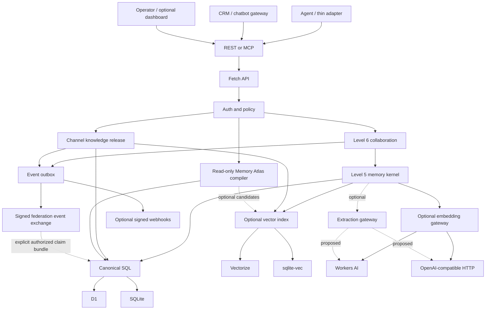

# Architecture overview

The end-to-end evidence, context, feedback, collaboration, and semantic-index
flow is defined in the [memory lifecycle protocol](./memory-lifecycle.md).
Agent installation, hooks, project resolution, event delivery, and the
orchestration boundary are defined in the
[agent integration flow](./agent-integration.md).
The separation between canonical memory and externally served knowledge is
accepted in [ADR-0002](../decisions/0002-channel-release-not-public-memory.md).
The optional operator projection boundary is defined in
[Memory Atlas](./memory-atlas.md) and accepted in
[ADR-0003](../decisions/0003-memory-atlas-authorized-projection.md).
The progressive operator information architecture is defined in
[DESIGN](../DESIGN.md).
Proposed automatic memory management is defined in
[ADR-0004](../decisions/0004-model-assisted-memory-enrichment.md).

## System shape

Titen is one TypeScript package with a shared Web-Standards core. Runtime
entrypoints assemble concrete capabilities; the core does not load provider
factories or runtime-specific modules dynamically.

## Component responsibilities

| Component          | Owns                                                   | Does not own      |
| ------------------ | ------------------------------------------------------ | ----------------- |
| HTTP app           | routing, validation, envelopes, request IDs            | memory policy     |
| Auth/policy        | identity, membership, scope, visibility, authorization | ranking           |
| Memory kernel      | observations, claims, context compilation, feedback    | agent loops       |
| Collaboration      | checkpoints, leases, handoffs, audit                   | task scheduling   |
| Channel release    | approved claim snapshots, channel/audience eligibility | public ingress    |
| Dashboard client   | progressively shipped operator interface               | domain authority  |
| Memory Atlas       | bounded authorized read-only projections               | canonical storage |
| Event delivery     | post-commit events, retries, signed webhooks           | agent selection   |
| Federation exchange | signed events plus explicit authorized direct-claim/evidence import | peer scheduling or consensus |
| SQL adapter        | canonical transactions, FTS, hydration, outbox         | semantic policy   |
| Vector adapter     | rebuildable embedding index                            | canonical content |
| Embedding gateway  | vectors for candidate retrieval                         | classification    |
| Extraction gateway | bounded derivation/reflection proposals; opt-in only   | authority/storage |
| Runtime entrypoint | bindings, startup, background trigger                  | domain logic      |

## Runtime matrix

| Capability | Cloudflare | VPS | Local computer |
| --- | --- | --- | --- |
| HTTP | Worker `fetch` | `Bun.serve` | `Bun.serve` on loopback |
| SQL | D1 | `bun:sqlite` | `bun:sqlite` |
| FTS | D1 SQLite FTS5 | SQLite FTS5 | SQLite FTS5 |
| Vector | optional Vectorize | optional `sqlite-vec` | optional `sqlite-vec` |
| Embedding adapter (implemented) | Workers AI | local or remote compatible HTTP | local or remote compatible HTTP |
| Additional Cloudflare embedding provider (proposed) | compatible HTTPS/VPC | n/a | n/a |
| Background maintenance | scheduled/manual index and delivery drain | startup/timer/manual index and delivery drain | startup/timer/manual index and delivery drain |
| Model enrichment (implemented, opt-in) | Cron/manual drain plus compatible HTTPS/VPC | startup/timer/manual drain plus compatible local or remote HTTP | startup/timer/manual drain plus compatible local or remote HTTP |
| Crypto | Web Crypto | Web Crypto | Web Crypto |

The core does not require `nodejs_compat` on Workers.

The base VPS does not require Postgres. A future `pgvector` adapter is justified
only when measured scale, concurrency, or an existing enterprise Postgres
topology outweighs the operational cost. Every vector backend still requires a
compatible embedding model at write and query time.

## Repository state and target runtime shape

The current checkout contains the memory kernel, authenticated REST/MCP app,
enterprise role/policy/approval/release/retention/identity boundaries, SQL
migrations, Cloudflare and Bun entrypoints, and a shared dual-runtime contract
suite. Their precise verification boundary is centralized in the [roadmap
maturity matrix](../ROADMAP.md#maturity-matrix).

The Astro dashboard is a live client of health, readiness, Memories, Context,
Work, Audit, Governance, and Federation through a same-origin loopback adapter.
Its optional per-principal login verifies canonical human password accounts,
seals short-lived raw API keys into opaque HttpOnly cookies with Web Crypto,
and optionally shares the sealing key across replicas; every API operation still performs canonical key, scope, role, and
organization authorization. Agent, service, SDK, CLI, and recovery clients keep
using API keys. A local build or disconnected page is not deployment evidence.
Signed federation
event exchange and its explicit organization-visible canonical claim/evidence
import mode are implemented; event-only exchange remains the default.

Automatic model-assisted derivation/reflection is implemented as an optional,
disabled-by-default capability. Maintenance drains its durable ledger only when
the extraction tuple and runtime scheduler are configured; production activation
still requires locked evaluation and real three-target smoke evidence. Capability
contract version 1 reports `embedding`, `extraction`, and
`background_enrichment` separately. Deprecated `capabilities.model` mirrors
embedding for `0.3.x` compatibility and must not be read as extraction readiness.

## Write path

1. Authenticate actor and derive organization/subject authority.
2. Validate and normalize the observation.
3. Commit observation, deterministic claim if supplied, FTS rows, history, and
   indexing/event outbox in one SQL transaction.
4. Return canonical success even when semantic indexing or webhook delivery is
   pending.
5. Configured background work drains indexing, delivery, and a separate leased
   enrichment ledger; every proposal is validated before claim/index mutation.

## Context path

1. Authenticate actor and resolve permitted scopes and visibility.
2. Build lexical and optional vector candidates within those scopes.
3. Hydrate canonical rows; discard tombstones, stale versions, and expired
   checkpoints.
4. Preserve conflicts and group sources by claim.
5. Rank by task relevance, trust, temporal validity, utility, and diversity.
6. Pack items under the caller's token budget.
7. Return structured untrusted context and a context ID for feedback.

## Collaboration path

1. An agent creates or resumes a checkpoint.
2. It acquires a short, idempotent lease on a bounded work item.
3. Progress is appended to the checkpoint; durable findings become observations.
4. A handoff transfers responsibility and cites checkpoint/evidence IDs.
5. Completion records an outcome and releases the lease.

This records coordination without deciding which agent should run next.
An orchestrator may consume a signed event or poll an authorized event cursor,
select an agent, and pass it a handoff ID. Titen then enforces the recipient's
scope, lease, checkpoint, and context rules.

## Memory Atlas path

1. Authenticate an operator and resolve the requested lens, focus, and scope.
2. Apply policy before candidate traversal or expansion.
3. Build a bounded projection from canonical relationships; an optional index
   may propose candidates but cannot authorize them.
4. Hydrate canonical rows and recheck both endpoints of every edge plus current
   lifecycle/version/visibility/release eligibility.
5. Return authorized nodes and edges with explicit truncation and degraded
   metadata; never include hidden topology or counts.
6. Render in an optional client. Renderer failure does not affect REST/MCP.

The compiler is a read-only REST integration in the same repository, not an
ordinary-agent MCP tool. Layout, clusters, summaries, and caches are
rebuildable and cannot become canonical memory.

## Dashboard path

1. Serve one optional static client that consumes authenticated REST only.
2. Render only areas implemented in the current build and discoverable by the
   authenticated principal; navigation never replaces route authorization.
3. Discover Memories, Context, Work, Audit, Governance, and Federation from the
   authenticated principal's scopes; an undiscoverable area exposes no control
   or prior private result.
4. Route each area only through the adapter's fixed method/path/query allowlist;
   Memories reuses Atlas and no dashboard route becomes domain authority.
5. Keep categories/tags as memory filters, events inside Audit, account settings
   absent, and backup/recovery in deployment tooling.

Disabling or rolling back the static client changes no canonical data, API
contract, or ordinary-agent MCP behavior.

## Channel knowledge path

1. An authorized publisher selects one exact active claim version.
2. An independent approval creates a bounded, optionally redacted/localized
   release snapshot for one channel, audience, and validity window.
3. SQL commits the release, history, FTS row, audit, and index/event outbox.
4. A CRM/chatbot gateway authenticates as a scoped service principal.
5. Channel context uses only active releases matching that gateway, audience,
   and validity; customer memory is added only after a short-lived signed
   assertion resolves an authenticated customer subject.
6. Revocation or replacement changes canonical eligibility before the next
   compile; stale cache/vector hits fail canonical hydration.

External users never query canonical memory directly. Live transactional facts
remain source-tool calls instead of stale knowledge releases.

## Failure boundaries

- SQL failure aborts the canonical mutation.
- Embedding/vector failure degrades semantic retrieval and leaves repairable
  index work.
- Under the optional enrichment contract, extraction failure never rolls back
  evidence; it leaves bounded enrichment work pending or terminally failed with
  no semantic mutation.
- Policy failure denies before retrieval.
- Channel approval/policy failure denies before release activation or context;
  vector failure degrades only to authorized release FTS.
- Memory Atlas failure disables only operator visualization; stale projections
  are re-authorized at canonical hydration and cannot widen scope.
- dashboard failure or omission leaves all headless REST/MCP behavior complete;
  an area without a current authorized contract has no route or control.
- Expired lease/checkpoint never becomes a durable fact.
- Signed event-exchange failure never changes local canonical event history;
  remote events become recallable only when an explicit claim filter,
  `include_memory`, peer HMAC, destination import authority, and complete
  canonical validation all pass in one SQL batch.

## Dependency budget

Astro, Playwright, and local fonts support the optional dashboard. The memory
service uses native `Request`, `Response`, Web Crypto, D1, `bun:sqlite`,
`Bun.serve`, and `fetch`; optional `sqlite-vec` is already isolated to the Bun
vector capability. Model-assisted enrichment adds no
provider SDK, queue, Redis, graph database, or dependency-injection framework.
