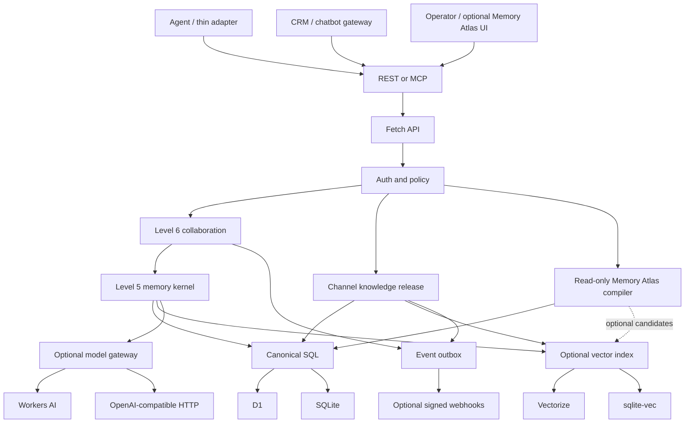

# Architecture overview

The end-to-end evidence, context, feedback, collaboration, and semantic-index
flow is defined in the [memory lifecycle protocol](./memory-lifecycle.md).
Agent installation, hooks, project resolution, event delivery, and the
orchestration boundary are defined in the
[agent integration flow](./agent-integration.md).
The separation between canonical memory and externally served knowledge is
accepted in [ADR-0002](../decisions/0002-channel-release-not-public-memory.md).
The optional operator projection boundary is defined in
[Memory Atlas](./memory-atlas.md) and accepted in
[ADR-0003](../decisions/0003-memory-atlas-authorized-projection.md).

## System shape

Titen is one TypeScript package with a shared Web-Standards core. Runtime
entrypoints assemble concrete capabilities; the core does not load provider
factories or runtime-specific modules dynamically.



## Component responsibilities

| Component          | Owns                                                   | Does not own      |
| ------------------ | ------------------------------------------------------ | ----------------- |
| HTTP app           | routing, validation, envelopes, request IDs            | memory policy     |
| Auth/policy        | identity, membership, scope, visibility, authorization | ranking           |
| Memory kernel      | observations, claims, context compilation, feedback    | agent loops       |
| Collaboration      | checkpoints, leases, handoffs, audit                   | task scheduling   |
| Channel release    | approved claim snapshots, channel/audience eligibility | public ingress    |
| Memory Atlas       | bounded authorized read-only projections               | canonical storage |
| Event delivery     | post-commit events, retries, signed webhooks           | agent selection   |
| SQL adapter        | canonical transactions, FTS, hydration, outbox         | semantic policy   |
| Vector adapter     | rebuildable embedding index                            | canonical content |
| Model gateway      | embeddings and optional structured extraction          | storage           |
| Runtime entrypoint | bindings, startup, background trigger                  | domain logic      |

## Runtime matrix

| Capability | Cloudflare                           | VPS                             |
| ---------- | ------------------------------------ | ------------------------------- |
| HTTP       | Worker `fetch`                       | `Bun.serve`                     |
| SQL        | D1                                   | `bun:sqlite`                    |
| FTS        | D1 SQLite FTS5                       | SQLite FTS5                     |
| Vector     | optional Vectorize                   | optional `sqlite-vec`           |
| Models     | optional Workers AI                  | optional OpenAI-compatible HTTP |
| Background | Cron Trigger and opportunistic drain | timer/systemd and startup drain |
| Crypto     | Web Crypto                           | Web Crypto                      |

The core does not require `nodejs_compat` on Workers.

The base VPS does not require Postgres. A future `pgvector` adapter is justified
only when measured scale, concurrency, or an existing enterprise Postgres
topology outweighs the operational cost. Every vector backend still requires a
compatible embedding model at write and query time.

## Planned repository tree

Only documentation exists before P0. Runtime directories are created when the
vertical spike starts.

```text
titen/
├── .github/
├── docs/
├── examples/                  # added after the external API stabilizes
├── migrations/
│   └── 0001_init.sql
├── src/
│   ├── app.ts                 # fetch router, validation, envelopes
│   ├── auth.ts                # identities, memberships, policy
│   ├── memory.ts              # observations, claims, context, feedback
│   ├── collaboration.ts       # checkpoints, leases, handoffs
│   ├── atlas.ts               # v0.2 read-only view compiler
│   ├── store.ts               # small SQL/vector/model contracts
│   ├── cloudflare.ts          # Worker bindings and scheduled handler
│   └── bun.ts                 # Bun server, SQLite, model HTTP
├── test/
│   └── contract.test.ts       # same behavior against both adapters
├── AGENTS.md
├── CONTRIBUTING.md
├── SECURITY.md
├── README.md
├── blueprint.md
├── package.json
├── pnpm-lock.yaml
├── tsconfig.json
└── wrangler.jsonc
```

Split a source file only after size, ownership, or runtime boundaries make the
split useful. Do not begin with packages, provider registries, repositories per
table, or dependency injection containers.

## Write path

1. Authenticate actor and derive organization/subject authority.
2. Validate and normalize the observation.
3. Commit observation, deterministic claim if supplied, FTS rows, history, and
   indexing/event outbox in one SQL transaction.
4. Return canonical success even when semantic indexing or webhook delivery is
   pending.
5. Background workers drain enrichment, vector, and delivery work.

## Context path

1. Authenticate actor and resolve permitted scopes and visibility.
2. Build lexical and optional vector candidates within those scopes.
3. Hydrate canonical rows; discard tombstones, stale versions, and expired
   checkpoints.
4. Preserve conflicts and group sources by claim.
5. Rank by task relevance, trust, temporal validity, utility, and diversity.
6. Pack items under the caller's token budget.
7. Return structured untrusted context and a context ID for feedback.

## Collaboration path

1. An agent creates or resumes a checkpoint.
2. It acquires a short, idempotent lease on a bounded work item.
3. Progress is appended to the checkpoint; durable findings become observations.
4. A handoff transfers responsibility and cites checkpoint/evidence IDs.
5. Completion records an outcome and releases the lease.

This records coordination without deciding which agent should run next.
An orchestrator may consume a signed event or poll an authorized event cursor,
select an agent, and pass it a handoff ID. Titen then enforces the recipient's
scope, lease, checkpoint, and context rules.

## Memory Atlas path

1. Authenticate an operator and resolve the requested lens, focus, and scope.
2. Apply policy before candidate traversal or expansion.
3. Build a bounded projection from canonical relationships; an optional index
   may propose candidates but cannot authorize them.
4. Hydrate canonical rows and recheck both endpoints of every edge plus current
   lifecycle/version/visibility/release eligibility.
5. Return authorized nodes and edges with explicit truncation and degraded
   metadata; never include hidden topology or counts.
6. Render in an optional client. Renderer failure does not affect REST/MCP.

The compiler is a read-only REST integration in the same repository, not a
seventh ordinary-agent MCP tool. Layout, clusters, summaries, and caches are
rebuildable and cannot become canonical memory.

## Channel knowledge path

1. An authorized publisher selects one exact active claim version.
2. An independent approval creates a bounded, optionally redacted/localized
   release snapshot for one channel, audience, and validity window.
3. SQL commits the release, history, FTS row, audit, and index/event outbox.
4. A CRM/chatbot gateway authenticates as a scoped service principal.
5. Channel context uses only active releases matching that gateway, audience,
   and validity; customer memory is added only after a short-lived signed
   assertion resolves an authenticated customer subject.
6. Revocation or replacement changes canonical eligibility before the next
   compile; stale cache/vector hits fail canonical hydration.

External users never query canonical memory directly. Live transactional facts
remain source-tool calls instead of stale knowledge releases.

## Failure boundaries

- SQL failure aborts the canonical mutation.
- Vector/model failure degrades semantic behavior and leaves repairable outbox
  work.
- Policy failure denies before retrieval.
- Channel approval/policy failure denies before release activation or context;
  vector failure degrades only to authorized release FTS.
- Memory Atlas failure disables only operator visualization; stale projections
  are re-authorized at canonical hydration and cannot widen scope.
- Expired lease/checkpoint never becomes a durable fact.
- Federation failure never changes the local canonical event history.

## Dependency budget

Expected P0 runtime dependencies:

- `zod` for trust-boundary validation;
- `sqlite-vec` only in the VPS adapter if the spike passes.

Memory Atlas adds no graph database or renderer dependency to the core. A UI
library may be selected only in its implementation spec after a representative
fixture measures bundle size, accessibility, and node limits.

Development dependencies:

- TypeScript;
- Wrangler.

Use native `Request`, `Response`, Web Crypto, D1, `bun:sqlite`, `Bun.serve`, and
`fetch` before adding frameworks or SDKs.
