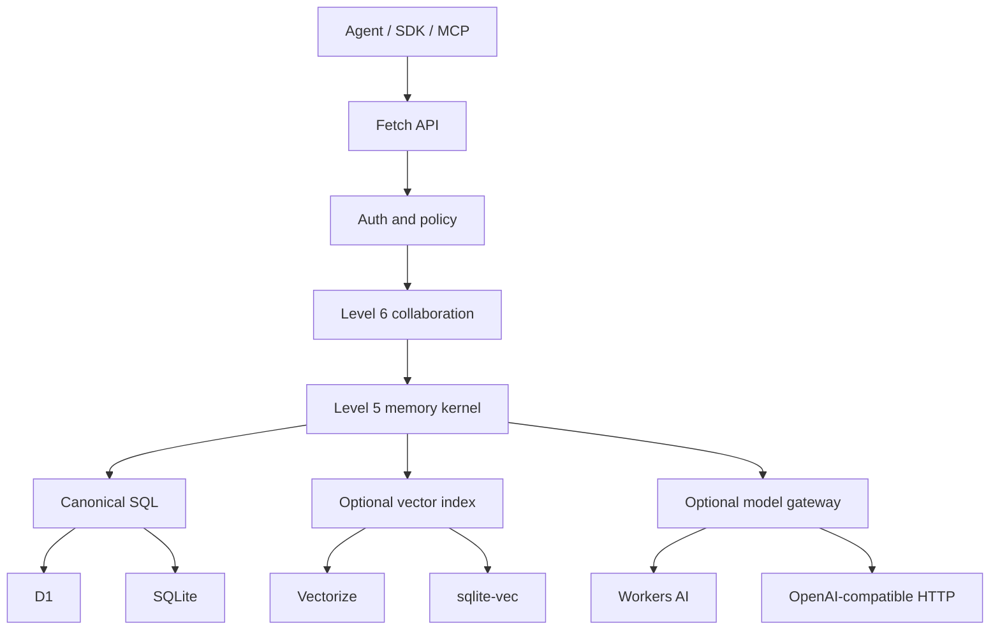

# Architecture overview

## System shape

Titen is one TypeScript package with a shared Web-Standards core. Runtime
entrypoints assemble concrete capabilities; the core does not load provider
factories or runtime-specific modules dynamically.



## Component responsibilities

| Component | Owns | Does not own |
| --- | --- | --- |
| HTTP app | routing, validation, envelopes, request IDs | memory policy |
| Auth/policy | identity, membership, scope, visibility, authorization | ranking |
| Memory kernel | observations, claims, context compilation, feedback | agent loops |
| Collaboration | checkpoints, leases, handoffs, audit | task scheduling |
| SQL adapter | canonical transactions, FTS, hydration, outbox | semantic policy |
| Vector adapter | rebuildable embedding index | canonical content |
| Model gateway | embeddings and optional structured extraction | storage |
| Runtime entrypoint | bindings, startup, background trigger | domain logic |

## Runtime matrix

| Capability | Cloudflare | VPS |
| --- | --- | --- |
| HTTP | Worker `fetch` | `Bun.serve` |
| SQL | D1 | `bun:sqlite` |
| FTS | D1 SQLite FTS5 | SQLite FTS5 |
| Vector | optional Vectorize | optional `sqlite-vec` |
| Models | optional Workers AI | optional OpenAI-compatible HTTP |
| Background | Cron Trigger and opportunistic drain | timer/systemd and startup drain |
| Crypto | Web Crypto | Web Crypto |

The core does not require `nodejs_compat` on Workers.

## Planned repository tree

Only documentation exists before P0. Runtime directories are created when the
vertical spike starts.

```text
titen/
├── .github/
├── docs/
├── examples/                  # added after the external API stabilizes
├── migrations/
│   └── 0001_init.sql
├── src/
│   ├── app.ts                 # fetch router, validation, envelopes
│   ├── auth.ts                # identities, memberships, policy
│   ├── memory.ts              # observations, claims, context, feedback
│   ├── collaboration.ts       # checkpoints, leases, handoffs
│   ├── store.ts               # small SQL/vector/model contracts
│   ├── cloudflare.ts          # Worker bindings and scheduled handler
│   └── bun.ts                 # Bun server, SQLite, model HTTP
├── test/
│   └── contract.test.ts       # same behavior against both adapters
├── AGENTS.md
├── CONTRIBUTING.md
├── SECURITY.md
├── README.md
├── blueprint.md
├── package.json
├── pnpm-lock.yaml
├── tsconfig.json
└── wrangler.jsonc
```

Split a source file only after size, ownership, or runtime boundaries make the
split useful. Do not begin with packages, provider registries, repositories per
table, or dependency injection containers.

## Write path

1. Authenticate actor and derive organization/subject authority.
2. Validate and normalize the observation.
3. Commit observation, deterministic claim if supplied, FTS rows, history, and
   indexing outbox in one SQL transaction.
4. Attempt bounded embedding/index work.
5. Return canonical success even when semantic indexing is pending.
6. Background repair drains the durable outbox.

## Context path

1. Authenticate actor and resolve permitted scopes and visibility.
2. Build lexical and optional vector candidates within those scopes.
3. Hydrate canonical rows; discard tombstones, stale versions, and expired
   checkpoints.
4. Preserve conflicts and group sources by claim.
5. Rank by task relevance, trust, temporal validity, utility, and diversity.
6. Pack items under the caller's token budget.
7. Return structured untrusted context and a context ID for feedback.

## Collaboration path

1. An agent creates or resumes a checkpoint.
2. It acquires a short, idempotent lease on a bounded work item.
3. Progress is appended to the checkpoint; durable findings become observations.
4. A handoff transfers responsibility and cites checkpoint/evidence IDs.
5. Completion records an outcome and releases the lease.

This records coordination without deciding which agent should run next.

## Failure boundaries

- SQL failure aborts the canonical mutation.
- Vector/model failure degrades semantic behavior and leaves repairable outbox
  work.
- Policy failure denies before retrieval.
- Expired lease/checkpoint never becomes a durable fact.
- Federation failure never changes the local canonical event history.

## Dependency budget

Expected P0 runtime dependencies:

- `zod` for trust-boundary validation;
- `sqlite-vec` only in the VPS adapter if the spike passes.

Development dependencies:

- TypeScript;
- Wrangler.

Use native `Request`, `Response`, Web Crypto, D1, `bun:sqlite`, `Bun.serve`, and
`fetch` before adding frameworks or SDKs.
