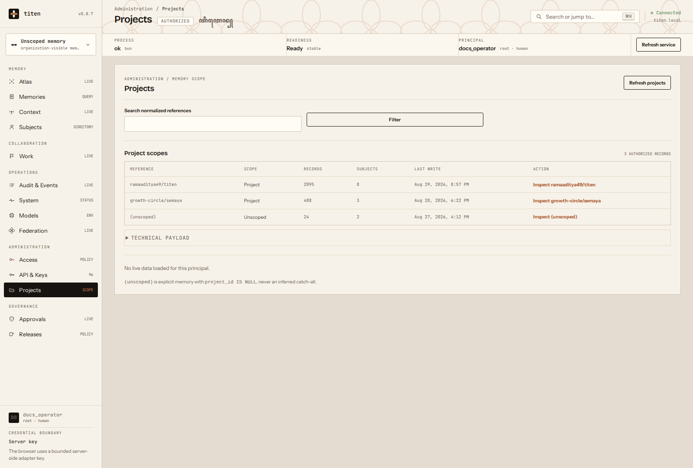
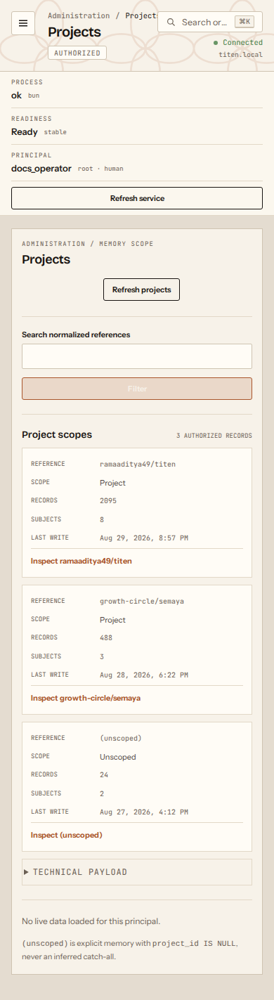

# Live operator dashboard

Titen includes an optional Astro dashboard at `/dashboard/`. It uses the
authenticated Titen API through a loopback same-origin adapter. Human operators
use username/password; the browser contains no fixture fallback and never stores
a password or API key in Web Storage.

The product map has fifteen live, capability-gated destinations:

| Area | Live job | Required read capability |
| --- | --- | --- |
| Memories | list, search, and paginate authorized canonical memories; open a selected record in Atlas | `views:compile` |
| Atlas | compile seven bounded read-only lenses, including the workspace-wide claim/subject graph | `views:compile` |
| Context | compile a cited task pack with its token budget and exclusions | `context:compile` |
| Subjects | inspect authorized subject identities and references | `subjects:read` |
| Work | inspect/release leases, resolve received handoffs, and find an exact checkpoint | matching collaboration capability |
| Audit | list bounded audit records and domain events | `audit:read` or `events:read` |
| System | inspect liveness, readiness, checks, and capabilities | authenticated |
| Models | inspect immutable masked startup tuples and run bounded read-only probes | `models:read` |
| Federation | inspect owned peers and a bounded peer log | `federation:read` |
| Access | inspect principals, grants, key clamps, and simulate both access gates | `principals:read`, `grants:read`, or `keys:manage` |
| API & Keys | browse fixed routes and create/revoke bounded keys | `keys:manage` |
| Projects | inspect authorized project scopes and normalized references | `projects:read` |
| Approvals | inspect policies and decide/revoke approvals with reasons | `governance:read` or `approvals:read` |
| Releases | inspect and operate the release lifecycle | `releases:read` |
| Profile | inspect the principal and manage password, passkeys, and recovery codes | authenticated full session |

The navigation hides an area when the signed-in principal has none of its
capabilities. That is presentation only: the API authenticates and authorizes
every request again.

## Read operator data

Each area uses the same information order:

1. Read the area heading and authorized record count.
2. Use the area filter when one is available.
3. Scan the task-specific columns or facts.
4. Select **Inspect** to open the record inspector.
5. Open **Technical payload** only when diagnosis needs the complete response.

Projects and Subjects show their canonical references after selection. Work,
Access, API & Keys, Approvals, and Releases place actions in the affected row.
Each successful action reloads server state. System and Models show named facts
instead of generic JSON records.

The dashboard separates Audit entries from domain events. It also separates
Federation peers from their exchange log. This prevents similar response keys
from receiving the wrong operator label.



On a phone, each table becomes a linear record list. The page does not require
horizontal scrolling at a 320 pixel viewport.



Memories and Atlas are principal-scoped by default, including for owners. A root/owner
with the separate `views:compile:all` capability may explicitly enable the
same-organization administrator view and choose a bounded incident/recovery
reason. The adapter forwards that mode only through the fixed Atlas route, and
the API records metadata-only audit evidence. The dashboard never probes for
hidden counts or claims that an empty principal-scoped result means canonical
memory is globally empty. Memories uses a stable keyset cursor rather than
offset pagination, so a page can be refreshed without compiling a graph or
waiting for semantic/vector readiness.

Canonical data also passes the scoped-grant gate documented in
[Scoped canonical access](./architecture/access-control.md). Access can inspect
principals and active grants, preview derived-key clamps, and simulate a known
record's `read`, `write`, or `approve` decision. A selected workspace filters
team-visible records; organization-visible memory remains present in every
workspace. Revoking an issuer grant narrows its derived keys on the next
request.

Models is an immutable diagnostic view. It masks secrets, reports configuration
and fingerprint drift, generates restart-only environment text, and performs
one rate-limited audited probe. It never updates model settings or canonical
memory from the browser.

## Run disconnected

```bash
pnpm install
pnpm dev
```

Open `http://127.0.0.1:4321/dashboard/`. Static Astro development has no
credential-bearing adapter, so it shows a disconnected state.

## Run with per-user login

The npm package includes the current dashboard build and adapter. Start the Bun
API first, then run the adapter from the same installed release:

```bash
TITEN_DASHBOARD_LIVE=true \
TITEN_DASHBOARD_AUTH=session \
TITEN_API_URL=http://127.0.0.1:8787 \
titen dashboard
```

A source checkout may use `pnpm build && pnpm dashboard:adapter` instead.

Open `http://127.0.0.1:4322/dashboard/` and sign in with an operator username and
password. The API verifies the password, issues a short-lived API key to the
adapter, which seals it with AES-GCM inside an opaque
`HttpOnly; SameSite=Strict` cookie. The raw key never enters browser-visible
JSON or Web Storage. Sessions expire after eight hours and fail closed after
logout, revocation, password change, tampering, or key rotation. With no
`TITEN_DASHBOARD_SESSION_KEY`, startup creates an ephemeral key and restart logs
everyone out. Replicas may share a base64url-encoded 32-byte key through their
secret manager when restart-stable sessions are required.

Failed password exchanges use one persistent hashed account bucket. The fifth
failure starts a 30-second delay. Later failures increase the delay to a maximum
of 30 minutes. The state survives service restarts and coordinates through SQL.

Where WebAuthn is configured, Profile can register and revoke passkeys. First
enrollment shows eight recovery codes once and revokes older dashboard
sessions. Later password logins create a 15-minute staged session. The private
product shell stays hidden until a passkey or unused recovery code succeeds.
Regeneration invalidates all prior recovery codes. Removing the last passkey
requires the current password.

`titen bootstrap` creates username `owner` and prints a random temporary
password once. A temporary password opens only the **Set a new password** page;
the private sidebar, topbar, and product routes remain unavailable. The change
revokes the temporary session and requires a fresh login. For a second
organization in the same database, pass a unique `--username` because dashboard
usernames are deployment-wide login identifiers.

For a remote HTTPS hostname, set its exact origin:

```bash
TITEN_DASHBOARD_LIVE=true \
TITEN_DASHBOARD_AUTH=session \
TITEN_API_URL=http://127.0.0.1:8787 \
TITEN_DASHBOARD_ORIGIN=https://memory.example.com \
TITEN_WEBAUTHN_RP_ID=memory.example.com \
TITEN_WEBAUTHN_ORIGIN=https://memory.example.com \
TITEN_WEBAUTHN_RP_NAME=Titen \
titen dashboard
```

The listener remains `127.0.0.1:4322`. The origin only authorizes the reverse
proxy Host and same-origin mutations and adds `Secure` to the session cookie.
Use [Tailscale Serve or Cloudflare Tunnel with Access](./deployment/secure-ingress.md)
instead of opening the adapter or API port.

## Add a user

An organization `owner` or `admin` with `keys:manage` and
`memberships:write` sees **Access → Add a human user**. One submission
creates the organization membership and its password account in one transaction.
Titen generates a random temporary password, displays it once, and requires the
new user to replace it on first login. An
admin cannot grant the owner role, scope/trust escalation is rejected, and a
partial failure creates neither record. No raw API key is returned.

Titen reuses its existing human principal, membership, scope, trust, and role
contracts. Email delivery, self-registration, social login, and SSO/SCIM remain
out of scope.

## Legacy server-key mode

Existing private installations can omit `TITEN_DASHBOARD_AUTH=session` and set
`TITEN_API_KEY`. Every browser then shares that one server-side principal and
user administration is disabled. Keep this mode behind a private ingress; use
session mode for a new deployment.

## Verification

```bash
pnpm verify:dashboard-live
pnpm test:adapter
pnpm build
pnpm test:browser tests/dashboard.spec.ts
pnpm check:workflow
```

The real smoke starts temporary Bun/SQLite and proves login, forced first
password replacement, all fifteen destinations, atomic Add User, lifecycle
actions, logout, and fresh login through the real adapter. Integration and
browser tests also cover credential isolation, revocation, exact origin checks,
request-size limits, capability hiding, stale private-state clearing,
principal-scoped empty results, audited administrator mode, workspace
visibility, scoped grants and key clamps, masked model diagnostics, structured
operator collections, semantic-sync readiness, keyboard use, and a 320 px
viewport.

Rollback is stopping the optional adapter or restoring the previous dashboard
image. Neither action mutates canonical memory.
